# Visão Computacional com CNNs e Transformers — Projeto da Disciplina

**Gilmar Oliveira de Medeiros** · Faculdade Infnet — Pós-Graduação em Deep Learning e Visão Computacional

Repositório: <https://github.com/gilmarmedeirosgil/infnet-cv-projeto-disciplina>

## Introdução

Este relatório reúne as cinco atividades do projeto da disciplina: um Vision Transformer implementado do zero e comparado com transfer learning (A1), CLIP em vocabulário aberto e busca semântica sem treino (A2), um classificador de imagens com CNN pré-treinada (A3), um estudo de caso de triagem de COVID-19 em raio-X com cGAN para augmentation sintética (A4.1) e uma análise crítica de transfer learning para tráfego urbano (A4.2, só texto). Para cada atividade: definição do problema, decisões técnicas e sua justificativa, resultados (métricas e gráficos) e análise crítica.

**Ambiente de execução.** Google Colab, runtime **T4** (obrigatório pelo enunciado; o Colab Pro/Plus oferece GPUs mais fortes, mas os tempos e VRAM reportados nos cabeçalhos de cada notebook são sempre da T4, exceto onde indicado o contrário — A2 roda em CPU por não ter treino). Os quatro notebooks executados (A1, A2, A3, A4.1) estão em `entregas/`, com outputs e o cabeçalho de memória/tempo; a A4.2 é só análise teórica, sem código.

**Reprodutibilidade e gates.** Cada atividade passou por um processo de duas etapas antes de entrar neste relatório: (1) execução no Colab com T4, conferida célula a célula contra o JSON final de métricas; (2) uma revisão adversarial (agente `revisor-rubrica`, rodando com acesso só de leitura) contra os itens da rubrica e as convenções de reprodutibilidade do projeto, seguida da aprovação de Gilmar num gate por atividade. Essa segunda revisão encontrou e corrigiu problemas reais — não só de redação: um bug de cache no A2 que produzia uma conclusão inteiramente errada ("CLIP tem desempenho fraco neste corpus"), contagens infladas na mesma atividade, faixas de referência fabricadas no A4.1 e uma citação com autoria trocada. O histórico completo de decisões, bugs encontrados e correções está em `docs/decisoes.md`; o plano e o checklist da rubrica, em `docs/PLANO_PROJETO.md`.

## A1 — Vision Transformer: implementação do zero e comparação com transfer learning

### Problema

Em uma linha de laminação a quente, a chapa de aço passa a vários metros por segundo; a inspeção visual humana é cansativa, inconsistente entre turnos e não acompanha a velocidade. Classificar automaticamente o tipo de defeito permite rastrear a causa no processo (cilindro danificado, carepa não removida, inclusões da aciaria) e decidir se a bobina é rebaixada ou sucateada. O **NEU Surface Defect Database** (Song & Yan, Northeastern University, 2013) é o benchmark clássico desse problema: 6 classes × 300 imagens 200×200 em tons de cinza — *crazing* (rede de microfissuras), *inclusion* (partículas incrustadas), *patches* (manchas), *pitted_surface* (pites/corrosão), *rolled-in_scale* (carepa laminada na superfície) e *scratches* (riscos).

O dataset é um bom teste para ViT por três motivos: (i) é **pequeno** (1.800 imagens), o que expõe a "fome de dados" do ViT treinado do zero; (ii) as imagens são **texturas**, não objetos centrados — o defeito ocupa a imagem toda ou aparece em pontos/linhas espalhados; (iii) está **longe do ImageNet** (cinza, sem objetos), o que testa quanto a transferência de um pré-treino em fotos naturais ajuda. Notebook: `notebooks/A1_vision_transformers.ipynb`, executado com "Executar tudo" numa T4 do Colab em **643 s** no total (VRAM de pico 4.834 / 1.389 / 733 MB para ViT-B/16, ViT do zero e ResNet-18, respectivamente).

### Dados

O pacote do Kaggle traz o NEU-DET já dividido em `train/images/<classe>` (240 por classe) e `validation/images/<classe>` (60 por classe); as duas partes foram reunidas e redivididas com um split estratificado próprio 70/15/15, para ter um teste separado da validação usada na escolha da época.

- **Integridade e formato.** 1.800 arquivos, todos JPEG RGB 200×200, com os três canais idênticos em todos (é cinza salvo como RGB; `convert("L")` não perde informação). **0 corrompidos.** Uma duplicata exata (MD5), dentro de *patches* (mesmo rótulo), foi removida: restaram **1.799 imagens únicas**.
- **Intensidade.** O brilho médio varia de 95 ± 29 (*scratches*) a 177 ± 49 (*pitted_surface*), mas os boxplots se sobrepõem em todas as classes: brilho sozinho não separa. O **contraste** (desvio-padrão dentro da imagem) separa mais: *patches* tem 54 ± 12, contra 13 ± 6 em *inclusion*, 16 ± 4 em *rolled-in_scale* e 22–29 nas demais — uma pista legítima (é a própria mancha que a gera) mas também um atalho fácil de mais.

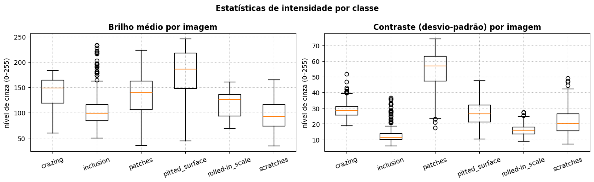

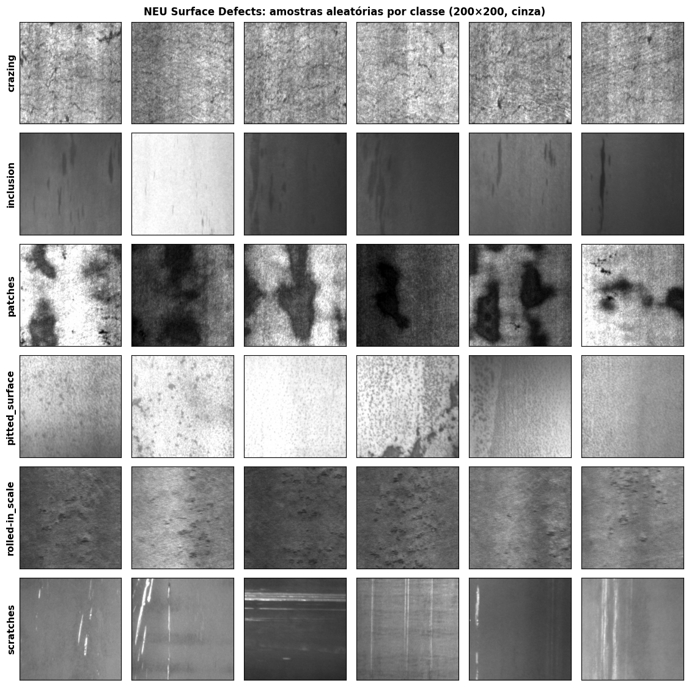

**Augmentation.** Orientação aleatória do grupo D4 (rotações de 90° + flips, sem custo de interpolação) e jitter leve de brilho/contraste (±10%), pensado para simular variação de iluminação/refletância entre bobinas e câmeras sem apagar a pista de contraste real entre classes.

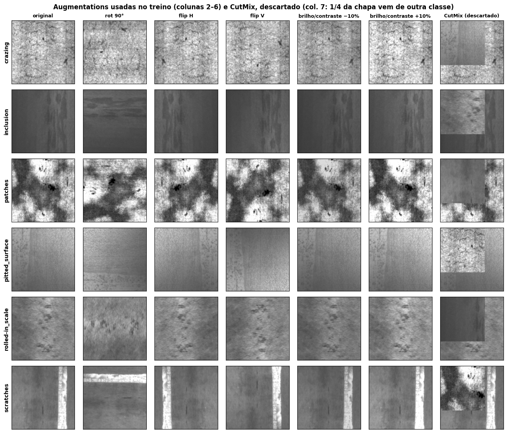

### Positional embedding: por que ele importa

Demonstração isolada do papel do PE: com e sem positional embedding, medindo a diferença entre a saída do encoder para uma imagem e a mesma imagem com os patches permutados.

- **Sem PE**, a diferença é desprezível: 1,8e-15 nos tokens e 3,8e-15 no CLS. Formalmente: com P a matriz de permutação dos patches, Q = X·W^Q etc., softmax(PQ(PK)ᵀ/√dₖ)·PV = P·Attention(Q,K,V) (o softmax por linha comuta com a permutação, e PᵀP = I); LayerNorm/MLP/residual agem token a token, então o encoder inteiro é **equivariante** à permutação dos patches — embaralhar as entradas só embaralha as saídas na mesma ordem. O CLS, que agrega uma soma ponderada sobre o conjunto de patches, fica **invariante** (não muda), porque essa soma não depende da ordem.
- **Com PE**, a diferença sobe para 0,19 (tokens) e 1,6e-3 (CLS). O CLS muda menos porque ele agrega informação de todos os tokens; a permutação redistribui, mas não destrói, o que ele vê.
- **Limite da demo:** ela mostra que o PE quebra a simetria de permutação, não que o modelo *usa* essa informação de forma útil — isso só é observado no teste de patches embaralhados (seção de atenção) e no treino em si.

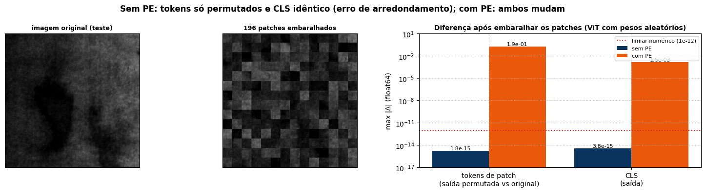

### Arquitetura e treino

**Três modelos, mesmo split, mesmo loop de treino** (AdamW, warmup linear + cosseno por passo, label smoothing 0,1, gradient clipping 1,0, AMP fp16 na T4, sem weight decay em bias/LayerNorm/CLS/PE), com seleção pela melhor época de macro-F1 de validação:

- **ViT do zero:** implementado peça por peça (SDPA, MHA com heads independentes, bloco Pre-LN, patch embedding), tamanho "ViT-Tiny raso" (dim 192, 6 blocos, 3 heads, MLP 4×, ~2,76 M parâmetros), canal único (`in_chans=1`, sem herdar pesos RGB). Patch 16, 224 px → 196 tokens + CLS, a mesma grade do ViT-B/16, para que os mapas de atenção sejam comparáveis patch a patch. LR 5e-4, 150 épocas (sem viés indutivo, precisa de muitas passadas).
- **ViT-B/16 in21k** (`google/vit-base-patch16-224-in21k`) e **ResNet-18** pré-treinada no ImageNet: LR baixa no backbone, 10× no head novo, 12 épocas.
- Testes de equivalência numérica confirmaram a implementação do zero (SDPA vs MHA manual, blocos Pre-LN) antes do treino real.

A **validação oscila ±5 p.p.** até por volta da época 60 e o melhor ponto do ViT do zero é a época 115; a loss de treino estabiliza em 0,421, o piso imposto pelo label smoothing 0,1 — por isso as confianças nos acertos ficam por volta de 92%, não perto de 100%.

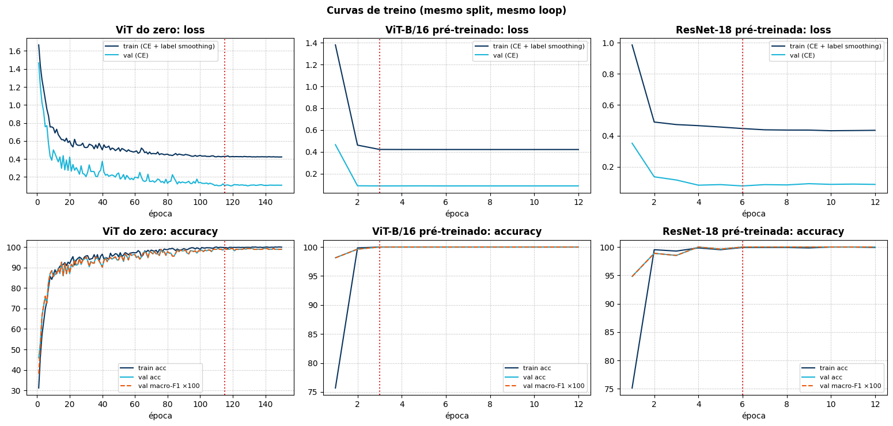

### Avaliação no teste e comparação

Cada modelo avaliado uma única vez no teste (270 imagens, 45 por classe), com os pesos da melhor época de validação:

| Modelo | Acertos | Accuracy | IC 95% (Wilson) | Macro-F1 | Params | Melhor época | Treino | VRAM pico | Inferência |
|---|---|---|---|---|---|---|---|---|---|
| ViT do zero | 266/270 | 98,52% | [96,25%; 99,42%] | 0,9851 | 2,76 M | 115/150 | 283 s | 1.389 MB | 0,43 ms/img |
| ViT-B/16 in21k | 270/270 | 100% | [98,60%; 100%] | 1,0000 | 85,8 M | 3/12 | 212 s | 4.834 MB | 4,32 ms/img |
| ResNet-18 | 270/270 | 100% | [98,60%; 100%] | 1,0000 | 11,2 M | 6/12 | 28,5 s | 733 MB | 0,49 ms/img |

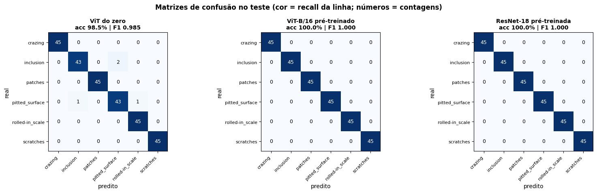

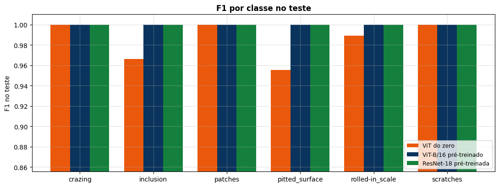

**O teste está saturado e não separa os modelos.** ViT-B/16 e ResNet-18 acertaram as 270 imagens, com as mesmas predições; o IC de Wilson para 270/270 vai de 98,60% a 100%. Entre o ViT do zero e o ViT-B/16 a diferença é de 4 imagens (1,48 p.p.); no teste de McNemar exato, as 4 discordâncias vão todas para o mesmo lado, o que dá **p = 0,125** (bilateral), e o IC de Newcombe para a diferença é **[−0,18; 3,75] p.p.**, que contém o zero. **Com 270 imagens, as três accuracies são estatisticamente compatíveis.** 3 dos 4 erros do ViT do zero são o par *inclusion* ↔ *pitted_surface*; *crazing* ↔ *rolled-in* não teve erro.

**Vazamento entre treino e teste, investigado e descartado.** 100% de acurácia com um modelo pré-treinado forte é o tipo de número que deveria levantar suspeita de vazamento, não ser comemorado sem checar — o NEU tem histórico conhecido de quase-duplicatas entre suas imagens (recortes próximos da mesma amostra física). Três verificações, nenhuma achou problema: (1) o split já garante, por *assert*, que não há duplicata exata (MD5) entre treino/val/teste; (2) reconstruindo o mesmo split localmente (mesma seed) e comparando cada imagem de teste contra o treino por *perceptual hash* (critério idêntico ao que achou o vazamento real do A3, distância de Hamming ≤ 4 em 64 bits), **nenhuma imagem de teste tem vizinho tão próximo no treino** — a distância mínima observada foi 8, a mediana 20; (3) o carregamento do teste (`evaluate(..., test_idx)`) usa o índice do split correto, conferido por leitura de código. Como controle adicional, o ViT do zero (sem pré-treino, o modelo mais fraco) erra 4 imagens com confusões plausíveis (*inclusion*↔*pitted_surface*, texturas de fato parecidas) em vez de também saturar em 100% — se houvesse vazamento sistêmico do split, o modelo mais fraco tenderia a se beneficiar dele também. A literatura reporta 97–99,6% como típico para ResNet/ViT fortes no NEU; 100% exato num teste de 270 imagens com classes de textura bem separadas é incomum mas não implausível. **Ressalva que fica registrada**: um modelo saturado no teste interno pode ser frágil fora da distribuição (outro hospital, outra câmera, outra linha de produção) — 100% aqui não é garantia de 100% em produção.

Como a accuracy não decide, **custo e convergência decidem**: o ViT-B/16 tem 7,7× os parâmetros da ResNet-18, usa 6,6× a VRAM de treino, treina 7,4× mais devagar e é 8,8× mais lento na inferência. A ResNet-18 chega a 100% de validação na época 4 (~10 s de treino); o ViT-B/16, na época 3 (~54 s) — as 9 épocas restantes (~160 s) não mudaram nada, porque a loss de treino já estava no piso do label smoothing. Com 12 épocas fixas, o ViT-B/16 gastou ~75% do tempo depois de já ter convergido.

### Mapas de atenção

Duas leituras nos dois ViTs: uma head da última camada (a de menor entropia CLS→patches na validação) e attention rollout (Abnar & Zuidema, 2020), além da distância média de atenção por camada (Dosovitskiy et al., Fig. 7).

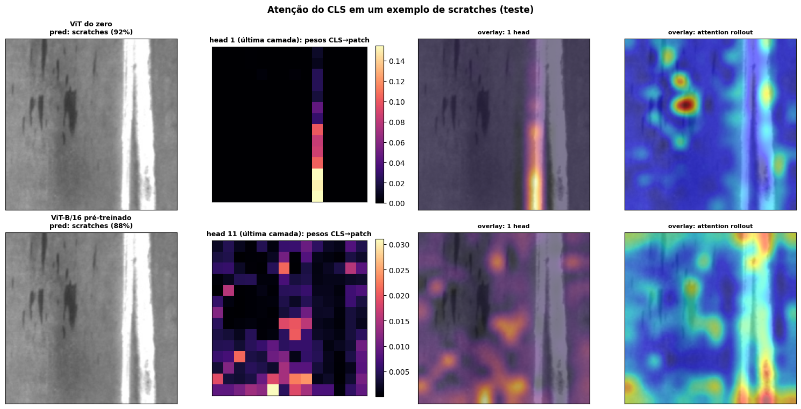

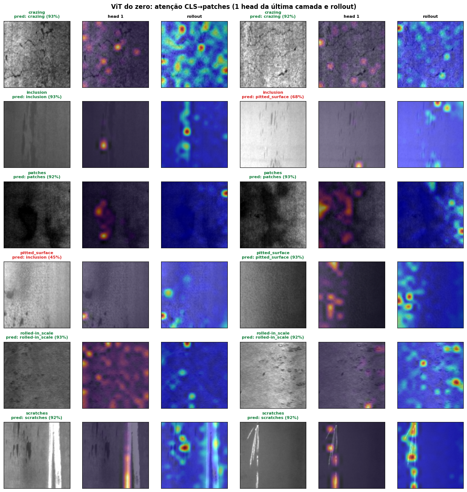

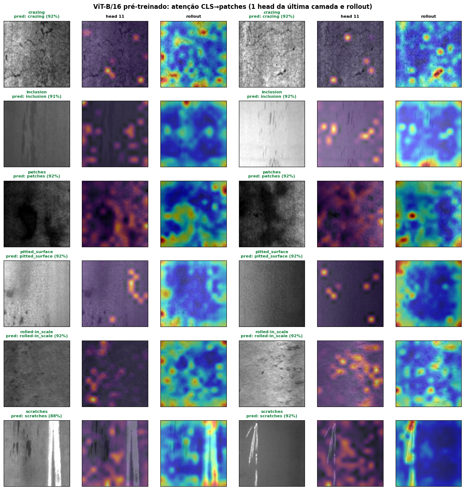

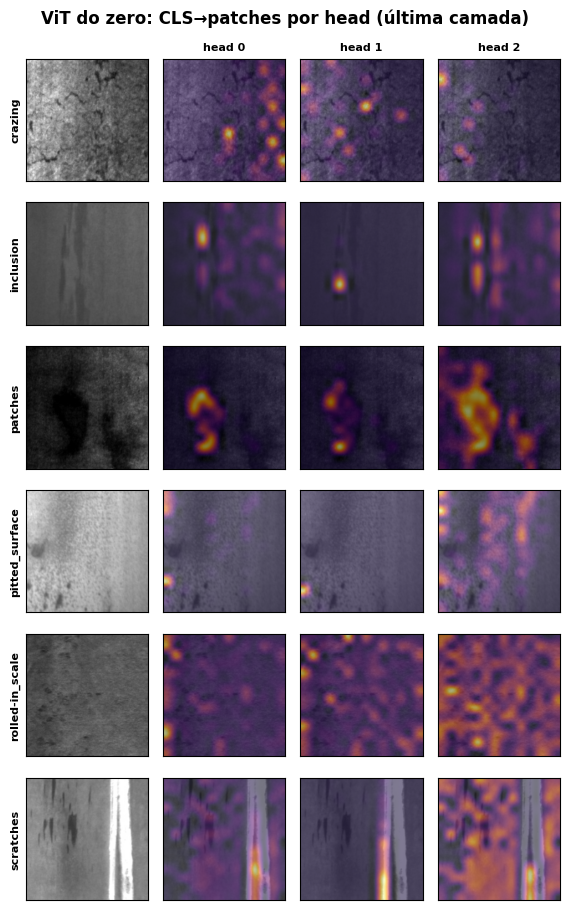

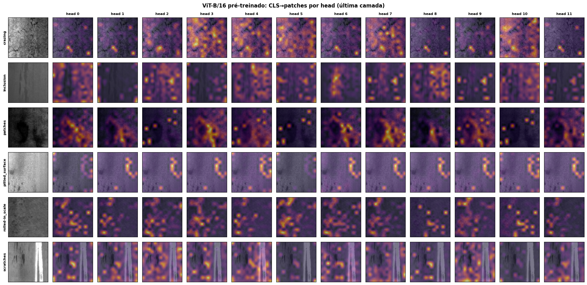

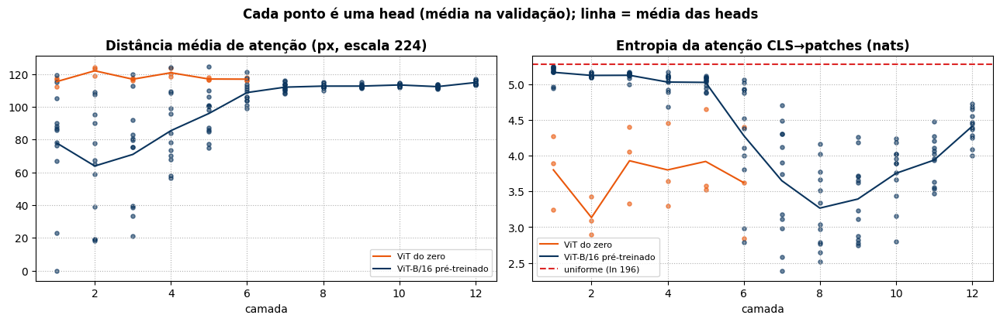

- No ViT do zero, a head 1 (última camada) chega a ser um "detector do risco" em *scratches*; no ViT-B/16, quem acompanha o risco é o rollout, não a head isolada — a informação sobre o risco aparece somando camadas e heads, não numa head só.
- Os dois erros visíveis na grade de atenção (10.2), do total de 4 do ViT do zero (*inclusion*↔*pitted*), coincidem com atenção caindo fora das marcas relevantes da imagem.
- No ViT-B/16, as 12 heads da última camada marcam o mesmo arco de patches em um exemplo de *pitted_surface*, sem defeito visível ali — hipótese não testada.
- O rollout do ViT-B/16 tem pico recorrente nas bordas/cantos da imagem em vários exemplos; hipótese (não testada) é o artefato de "registers" descrito em ViTs grandes (Darcet et al., 2024).
- **Distância de atenção.** O ViT do zero fica entre 115 e 122 px em todas as 6 camadas — praticamente igual aos 116,5 px que se obtém quando o peso de atenção não depende da distância (grade 14×14, espaçamento 16 px): ele **não desenvolveu nenhuma head local**. O ViT-B/16 tem heads entre 0 e 40 px nas camadas 1–3 (locais, "convolucionais"), convergindo para o regime global (108–115 px) a partir da camada 6.
- **Entropia.** A hipótese de que a última camada do ViT do zero seria pouco especializada (perto da uniforme) foi **refutada**: suas 3 heads têm entropia média 3,62 nats, mais focadas que as 12 do ViT-B/16 (média 4,41 nats; uniforme seria ln 196 = 5,28 nats).
- **Patches embaralhados.** ViT do zero: 98,52%→98,52% (mesmo nº de acertos); ViT-B/16: 100%→98,89% (queda pequena); ResNet-18: 100%→44,07% (ainda bem acima do acaso de 16,7%, mas queda grande). Leitura: para os dois ViTs, o NEU se comporta quase como um "saco de patches" — a organização espacial entre patches de 16 px carrega pouca informação que eles usem. **Confundidor:** o embaralhamento em blocos de 16 px está alinhado com a grade de tokenização dos ViTs (cada token continua vendo um patch intacto), mas cria 196 bordas artificiais que os filtros da CNN detectam como estrutura nunca vista no treino — o teste favorece os ViTs por construção e mistura dependência espacial real com sensibilidade a um artefato fora da distribuição.

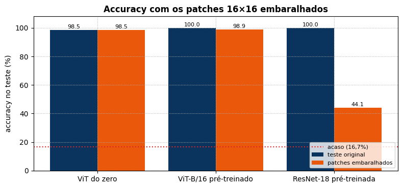

**Limites da leitura de atenção.** Atenção não é explicação causal (o rollout ignora o MLP e os valores V); as observações usam 2 exemplos por classe, e só os padrões que se repetem nos dois exemplos têm algum peso.

### Discussão

**Pré-treino do BERT vs pré-treino do ViT (o que cada um maximiza).** O BERT (MLM, auto-supervisionado) maximiza a verossimilhança do **token mascarado dado o contexto bidirecional**, max Σ_(i∈M) log p(xᵢ | x_(∖M)) — o sinal vem da própria estrutura do texto, sem rótulo humano. O ViT original (supervisionado) maximiza a verossimilhança do **rótulo da imagem inteira**, max log p(y | x), lida no CLS — depende de rótulos humanos em grande escala (ImageNet-21k/JFT-300M). Aqui, o ganho desse pré-treino supervisionado é pequeno em accuracy (100% vs 98,52%, diferença não significativa) e grande em convergência (época 3 contra 115) — o pré-treino comprou velocidade e menos risco de overfitting, não um teto mais alto.

**DeiT e Swin (o que cada um resolve).** O DeiT resolve a dependência de pré-treino gigante: com uma receita de augmentation forte e um **token de destilação** (que imita uma CNN professora), o ViT fica competitivo treinando só no ImageNet-1k — ataca a mesma fome de dados por trás da convergência lenta observada aqui (época 115 do ViT do zero). O Swin resolve dois problemas estruturais do ViT original: o custo **quadrático** da atenção global em alta resolução (via atenção em janelas locais, custo linear) e a falta de representação **multiescala** (via *patch merging* hierárquico, como uma CNN) — interessaria se o problema virasse detecção (o NEU-DET tem caixas) ou imagens de linha em alta resolução. Nenhum dos dois foi treinado neste notebook (`RUN_EXTRAS = False`).

**Quando o ViT supera a CNN, quando a CNN é preferível.** A expectativa de que o ViT do zero ficaria "claramente abaixo" foi refutada na accuracy e confirmada na convergência; a expectativa de que ViT pré-treinado e ResNet-18 ficariam próximos, com a CNN mais barata, foi confirmada — o viés de localidade da CNN não trouxe accuracy extra sobre o ViT pré-treinado, só o mesmo resultado por um custo bem menor. Isso é coerente com a distância de atenção (o ViT-B/16 "reaprendeu" localidade nas primeiras camadas via pré-treino; o ViT do zero não aprendeu nenhuma) e com o teste de patches embaralhados (textura estacionária, onde localidade não é necessária para acertar).

**Escolha de arquitetura para este domínio.** Com F1 empatado entre os três modelos (inclusive nas classes críticas *inclusion* e *scratches*), o critério de menor custo decide: **recomendo a ResNet-18** — mesma accuracy do ViT-B/16 com 7,7× menos parâmetros, 6,6× menos VRAM e ~9× menos latência, decisivo para um modelo rodando continuamente numa linha industrial. O ViT-B/16 só se justificaria por uma vantagem não medida aqui (robustez a domínio, fine-tuning incremental sem rótulo). O ViT do zero fica descartado para produção (150 épocas de treino), mas é a opção mais leve em inferência pura.

**Próximos passos, em ordem de prioridade:** (1) avaliação mais robusta (validação cruzada, várias seeds — 45 imagens por classe no teste deixam ICs de vários p.p., a lacuna que mais limita as conclusões); (2) arquiteturas híbridas/com viés de localidade (stem convolucional, Swin-T, ConvNeXt-T — o mais barato de testar e o que mais ataca a falta de localidade do ViT do zero); (3) pré-treino auto-supervisionado no domínio (MAE/DINO) e destilação estilo DeiT, quando houver imagens de aço sem rótulo disponíveis; (4) passar para detecção (NEU-DET tem caixas), a mudança de escopo mais cara.

### Uso de IA

Notebook (`notebooks/src/A1_vision_transformers.py` → `.ipynb`) escrito com Claude Code (`construtor-notebook`): EDA do NEU, split 70/15/15, pipeline na GPU com augmentation D4 + jitter, SDPA/MHA/bloco Pre-LN/PatchEmbedding/ViT do zero com testes de equivalência, demo de PE por permutação, loop comum com AMP e checkpoint/retomada no Drive, comparação ViT do zero vs ViT-B/16 in21k vs ResNet-18, mapas de atenção (1 head + rollout), distância de atenção, teste de patches embaralhados. Análises e discussão (`analista-resultados`) a partir de `resultados/A1/` e das figuras geradas: leitura das métricas de teste com IC de Wilson e McNemar, leitura visual dos mapas de atenção com hipóteses marcadas como tais, e a seção de discussão (11.1–11.5) amarrando os argumentos teóricos aos números medidos. Verificação humana: pendente de revisão por Gilmar; números conferidos contra `resultados/A1/metrics.json` e `outputs.json`, e depois contra o `.ipynb` executado na T4 (seção "Uso de IA" de `docs/decisoes.md`, 28/09/2026); causas de erro e hipóteses sobre atenção mantidas como hipóteses, não como fato.

## A2 — CLIP no ADS-16 (sem treino)

### Problema

Usar o CLIP **pré-treinado, sem nenhum treino supervisionado**, para (a) rotular por vocabulário aberto um corpus de imagens de anúncios e preferências de usuários (ADS-16) contra 25 conceitos, com threshold justificado; (b) fazer busca semântica texto→imagem com 10 consultas; (c) discutir por que o pré-treino contrastivo permite isso e como a tokenização do CLIP difere da do BERT.

**Citação exigida pela licença do ADS-16** (Roffo & Vinciarelli, EMPIRE 2016): *"The research in this paper use the ADS-16 database."*

### Corpus

O ADS-16 vem em **duas partes** (`ADS16_Benchmark_part1`/`part2`), cada uma com metade das 20 categorias de anúncio (1–10 e 11–20) e metade dos 120 usuários (U0001–U0060 e U0061–U0120), sem sobreposição — uma armadilha real do dataset: montar o corpus lendo só uma parte dá metade do esperado. Corrigido, o corpus final tem **650 imagens**: **301 anúncios** (as 20 categorias completas) + **349 imagens de usuários** (favoritas/não favoritas, amostradas estratificado por usuário × POS/NEG, de **120 usuários**), conforme a decisão D9.

### CLIP pré-treinado e alinhamento visual-textual

`openai/clip-vit-base-patch32`, 151,3 M parâmetros; `logit_scale.exp() = 100,00` (τ = 0,01). O encoder de imagem (ViT-B/32) e o de texto (Transformer causal, BPE) não têm co-atenção entre si; cada saída é projetada para 512 dimensões e L2-normalizada na mesma hiperesfera, e a similaridade é o cosseno. O pré-treino contrastivo (InfoNCE simétrica, 400 M pares imagem-legenda da web, sem rótulo humano) é o que permite usar qualquer frase nova como consulta sobre um corpus nunca visto — sem rotular nem treinar nada no ADS-16.

**Checagem de sanidade do pipeline**: zero-shot dos 301 anúncios contra as 20 categorias do próprio ADS-16 (1 template, sem *ensembling*) acerta **55,8%** (acaso = 5%) — evidência de que os embeddings de imagem e texto estão corretamente extraídos e alinhados antes de confiar no restante da análise.

### Ranking de conceitos por vocabulário aberto

25 conceitos, com *prompt ensembling* (8 templates + média + renormalização). **Threshold**: margem sobre um prompt neutro (`"a photo."`, `"an advertisement."`, `"a picture."`), calibrado no percentil 90 da distribuição de margens (δ = 0,0070).

| Conceito | Frequência | % do corpus | Score médio |
|---|---|---|---|
| a kitchen appliance | 154 | 23,7% | 0,1994 |
| a toy | 145 | 22,3% | 0,2010 |
| an item of clothing | 126 | 19,4% | 0,2005 |
| a garden tool | 123 | 18,9% | 0,1963 |
| sports equipment | 108 | 16,6% | 0,1968 |

**Critério de contagem** (vale para o top-4 dos conceitos e o top-5 da busca). Conto como acerto só quando a imagem mostra claramente um exemplar do conceito ou da consulta. Produto ou tema só tangencialmente relacionado conta como erro. Imagem preta e duplicata do mesmo item também. Para consultas abstratas, acerto é uma imagem que usa a convenção visual ou publicitária do tema. Anúncios só com texto (capturas de anúncio do Google) são marcados à parte como "só texto".

| Conceito | Top-4 (esquerda → direita) | Acertos |
|---|---|---|
| a kitchen appliance | geladeira ✔ · anúncio-texto "Swatch Sale" (relógios) ✘ · comida frita pixelada numa panela escura, aparelho não identificável ✘ · anúncio-texto "Ovens Cookers" (só texto) | 1/4 (2/4 com só texto) |
| a toy | bico de mamadeira MAM ✘ · bola de tênis ✘ · "THE TOY SALE" com caminhão de brinquedo ✔ · anúncio-texto de Lego (só texto) | 1/4 (2/4 com só texto) |
| an item of clothing | anúncio da American Apparel com modelo de body ✔ · estampa xadrez (tecido, não peça) ✘ · feijão cozido ✘ · calça jeans ✔ | 2/4 |
| a garden tool | rolo de pintura ✘ · flauta de bambu ✘ · imagem preta ✘ · flores num jardim, sem ferramenta ✘ | 0/4 |
| sports equipment | bola de tênis ✔ · mesa de pingue-pongue ✔ · hoverboard ✘ · imagem preta ✘ | 2/4 |

**Total: 6 de 20 (30%)**; 8 de 20 contando os anúncios só texto; 6 de 18 excluindo as 2 imagens pretas. Uma versão anterior deste texto dava "3 de 4" em três conceitos: contava bola de tênis como brinquedo, relógio e comida como eletrodoméstico. A recontagem estrita corrige isso.

**Análise crítica do ranking.** *A garden tool* é o 4º conceito mais frequente (123 imagens) e tem 0 acertos no top-4. A frequência, portanto, não mede presença real. O motivo é de construção. O δ é global (percentil 90 de todas as margens, o que força ~10% dos pares a "ocorrer"). A margem sobre o prompt neutro remove o viés **por imagem**, mas não o viés **por conceito**. Conceitos cujo texto fica mais perto da média do corpus acumulam ocorrências. A ordem da frequência acompanha o score médio do conceito: os 5 primeiros têm score médio entre 0,1963 e 0,2010; os 5 últimos (*a pair of shoes*, *a motorcycle*, *a bicycle*, *money or casino chips*, *a guitar*), entre 0,1657 e 0,1778. Há ainda dois efeitos do domínio. O CLIP lê texto: 3 das 20 imagens são anúncios só texto recuperados pela palavra ("Ovens", "Lego", "Swatch"). E há imagens "hub", que aparecem em vários conceitos: a bola de tênis está em *a toy* e em *sports equipment*; o bico MAM volta como top-1 da busca por perfume. Conclusão: o ranking é acima do acaso nos conceitos com objeto visual distintivo (roupa, esporte) e falha nos vagos (*garden tool*). Como estimativa de prevalência no corpus, é fraco.

### Busca semântica texto→imagem

10 consultas, do concreto ao abstrato, com o mesmo critério de contagem.

| # | Consulta | Top-1 (cos) | Top-5 (o que aparece) | Acertos |
|---|---|---|---|---|
| 1 | a photo of a dog | 0,284 | cão ✔ · cão komondor ✔ · meme com cão ao volante ✔ · rato-toupeira-pelado ✘ · cão ✔ | 4/5 |
| 2 | a red sports car | 0,247 | anúncio-texto de peças ✘ · meme do cão ao volante ✘ · pandeiro vermelho ✘ · aspirador automotivo ✘ · anúncio-texto de peças ✘ | 0/5 |
| 3 | a pair of running shoes | 0,269 | anúncio-texto da Zappos (só texto) ✘ · anúncio de tênis Adivon ✔ · tênis pretos ✔ · fraldas/embrulhos ✘ · vespa ✘ | 2/5 |
| 4 | a bottle of perfume | 0,262 | bico de mamadeira MAM ✘ · anel numa caixa ✘ · preservativos Durex ✘ · batata Kettle ✘ · anúncio-texto de bálsamo pós-barba ✘ | 0/5 |
| 5 | electronic devices and gadgets | 0,273 | anúncio-texto "Baby Gadgets" ✘ · meme "Phonies" ✘ · carteira com pernas desenhadas ✘ · logotipo de acessórios automotivos ✘ · anúncio de tablets ✔ | 1/5 |
| 6 | a family having dinner together | 0,233 | carne assada, sem pessoas ✘ · imagem preta ✘ · porcos ✘ · grupo de amigos, sem refeição ✘ · sapos ✘ | 0/5 |
| 7 | an advertisement about love and dating | **0,304** | casal se beijando ✔ · Match.com ✔ · Zoosk ✔ · Senior Dating Site ✔ · coração de app de namoro ✔ | 5/5 |
| 8 | a feeling of luxury and exclusivity | 0,255 | resort com piscina ✔ · sabonete Dove ✘ · anúncio-texto "Luxury Pens" ✔ · anúncio-texto de joalheria ✔ · anúncio-texto "Finest TVs" ✘ | 3/5 |
| 9 | excitement and adrenaline | 0,250 | wakeboard ✔ · meme de iguana gritando ✘ · cavalo galopando ✘ · motocross ✔ · faixa de Lego ✘ | 2/5 |
| 10 | trust and reliability | 0,248 | mãos dadas ✔ · pedra com moedas douradas ✘ · pôster "believe in yourself" ✘ · janela com chuva e citação ✘ · a mesma imagem de novo (duplicata) ✘ | 1/5 |

**Total: 18 de 50 (36%).** Só 2 das 10 consultas têm ≥4/5. As 6 concretas somam 7/30; as 4 abstratas, 11/20.

**Onde funciona.** *Cão* (4/5): objeto visual distintivo e comum em fotos pessoais. *Namoro* (5/5), a consulta de maior cosseno: 3 dos 5 acertos são anúncios só texto, recuperados porque o CLIP lê "Dating Site" na imagem. *Luxo* (3/5) também é puxado por texto: 2 dos 3 acertos são anúncios-texto ("Luxury Pens", joalheria). *Adrenalina* (2/5): wakeboard e motocross são a convenção publicitária do tema; o meme da iguana gritando e o cavalo galopando pegam "emoção/movimento" sem ser adrenalina.

**Onde falha.** *"a red sports car"* (0/5): a consulta se decompõe em pedaços. "car" traz peças e aspirador automotivo, "red" traz um pandeiro vermelho. Sem anotação, não dá para saber se o corpus tem algum carro esportivo vermelho: 0/5 pode ser ausência, não só falha. *"a family having dinner together"* (0/5) é composicional: aparecem comida e pessoas juntas, nunca na mesma cena. *"a bottle of perfume"* (0/5): o top-1 é o bico de mamadeira, que tem forma de frasco, e o resto é embalagem pequena de consumo (preservativos, batata, bálsamo). O CLIP pegou "frasco/embalagem de produto", não "perfume". *"electronic devices and gadgets"* (1/5) é puxado pela palavra "Gadgets" num anúncio de produtos de bebê e pela piada "Phonies" (de *phones*). *"trust and reliability"* (1/5): só as mãos dadas usam a convenção de confiança; o pôster "believe in yourself" e a citação sobre a chuva são proximidade lexical com crença e frase motivacional. As posições 4 e 5 são **a mesma imagem**, presente duas vezes no corpus com caminhos diferentes (provavelmente marcada por dois usuários): a amostragem estratificada por usuário não deduplica por conteúdo.

**O cosseno do top-1 não prediz acerto.** A faixa é estreita (0,233 a 0,304). Os extremos batem (namoro 0,304 → 5/5; família 0,233 → 0/5), o meio não: eletrônicos (0,273) tem 1/5 e perfume (0,262) tem 0/5, enquanto luxo (0,255) tem 3/5. As consultas abstratas ficam, em cosseno, majoritariamente na metade de baixo (3 das 4), mas acertam mais que as concretas. O corpus é de anúncios, e as consultas abstratas batem com convenções publicitárias e com o texto impresso nas peças.

**Conclusão.** Com o pipeline corrigido, o CLIP ViT-B/32 recupera **acima do acaso, mas de forma irregular**: 18/50 na busca, 6/20 no top-4 dos conceitos, coerente com o zero-shot de 55,8% (acaso 5%). Funciona com objeto visual distintivo ou quando o anúncio escreve o assunto. Falha em objeto + atributo, em cena composicional e em conceitos vagos. Não é "recupera a maioria das consultas corretamente", como dizia uma versão anterior deste texto.

### Pré-processamento: transparência e imagens pretas

**Transparência.** A conversão `Image.open(p).convert("RGB")` descarta o canal alfa: numa imagem com pixels transparentes, a área transparente vira o RGB "por baixo", em geral preto. O notebook agora compõe essas imagens sobre fundo branco (`load_rgb`), no embedding e nas figuras. A checagem `has_alpha` (modo RGBA/LA/PA ou chave `transparency`) encontrou **358 das 650 imagens (55,1%) com canal alfa**. Esse número conta a **presença do canal**, não de pixels transparentes. O efeito medido da correção foi pequeno. O zero-shot ficou idêntico (55,8% antes e depois). Nos 5 conceitos do topo, só 2 frequências mudaram, em 1 imagem cada: *a kitchen appliance* 153 → 154, *sports equipment* 109 → 108. As 3 primeiras linhas da grade de conceitos trazem as mesmas 12 imagens descritas na execução anterior. Isso indica que a maioria das 358 tem alfa totalmente opaco (canal presente, sem transparência real), e que poucas imagens tinham de fato área transparente pintada de preto. Quantas exatamente não foi medido (seria `alpha.min() < 255`). A correção fica como necessária e defensiva, não como explicação de uma degradação em massa.

**Imagens pretas residuais.** Mesmo com `load_rgb`, 3 imagens continuam pretas nas figuras: 2 na grade de conceitos (*a garden tool*, 3ª coluna; *sports equipment*, 4ª coluna) e 1 na busca (*"a family having dinner together"*, 2ª coluna). A contagem na grade de conceitos é a mesma de antes da correção (2 de 20), então **a transparência não era a causa desses quadrados pretos**. A causa segue não identificada. Hipóteses: imagem genuinamente preta ou quase preta no arquivo; modo de cor não tratado (ex.: 16 bits, CMYK); arquivo parcialmente corrompido que o PIL abre sem exceção. As 3 imagens representam <0,5% do corpus e não mudam a leitura geral, mas aparecem com cosseno alto (0,262, 0,261, 0,227). Isso sugere que o CLIP gera um embedding de "imagem vazia" que fica perto de conceitos genéricos. Fica registrado como limitação conhecida, não resolvida.

### Um bug real, encontrado e corrigido: o cache de embeddings

Uma primeira leitura destes mesmos experimentos (execução anterior) concluiu, incorretamente, que "o CLIP tem desempenho fraco neste corpus" — nenhuma imagem do top-4/top-5 correspondia ao conceito ou à consulta. Uma revisão adversarial (`revisor-rubrica`) apontou a causa mais provável: o cache de embeddings (`OUT_DIR/A2_image_embeds.npy`) não era invalidado quando o corpus mudava — uma execução anterior (com um bug diferente na montagem do corpus, já corrigido) gravou o cache, e a execução seguinte **carregou esse cache** ("Embeddings carregados do cache") sobre um `corpus_df` reconstruído, desalinhando linha a linha embeddings e imagens. Corrigido (cache agora chaveado por um *hash* do corpus; extração do embedding verificada contra o forward cru do `CLIPModel`), os mesmos experimentos, com os mesmos 25 conceitos e 10 consultas, saem de 0 acertos para 6/20 (conceitos) e 18/50 (busca). **A causa do "zero" era um bug de engenharia.** O resultado corrigido, porém, é moderado e irregular, não "majoritariamente positivo" como uma versão intermediária deste texto afirmava antes da recontagem estrita.

### CLIP vs. BERT: tokenização

CLIP (BPE, causal, máximo 77 tokens, vetor no token EOT) vs. BERT (WordPiece, bidirecional, vetor no `[CLS]`). Medido: a diferença entre o embedding do CLIP com padding dinâmico e com `padding="max_length"=77` (ambos com `attention_mask` correta) é de **1,49×10⁻⁷**. Esse valor é ruído de ponto flutuante (as duas entradas têm comprimentos diferentes, logo matrizes de formas diferentes). O teste que isola a tese causal+EOT é outro: mesmo input com `max_length=77`, máscara correta vs. máscara toda em 1 (fingindo que não há padding). A diferença é **exatamente 0,0** (`diff_clip_nomask` no JSON final), bit a bit igual. Com a máscara causal, a linha do EOT nunca atende às posições depois dele, então a máscara dos PADs nem entra no cálculo do vetor usado. O CLIP não depende da máscara para ignorar o padding. No BERT, o mesmo experimento (zerar a máscara de padding) muda o `[CLS]` da frase mais curta em até **5,42** (norma absoluta) — a atenção bidirecional faz o `[CLS]` atender aos tokens de padding quando a máscara não os exclui, ordens de grandeza maior que no CLIP.

### O que eu mudaria

- Normalizar o score **por conceito** (z-score por coluna da matriz imagem×conceito) antes do threshold, para o ranking medir prevalência e não proximidade do conceito à média do corpus.
- Deduplicar o corpus por conteúdo (hash perceptual), já que a mesma imagem aparece com caminhos diferentes.
- Medir pixels de fato transparentes (`alpha.min() < 255`) e registrar caminho, modo e estatísticas das 3 imagens pretas.
- Anotar uma amostra do corpus para medir precisão@k com rótulo, em vez de só inspeção visual.
- Testar um checkpoint maior (ViT-B/16 ou ViT-L/14) nas consultas composicionais e de objeto + atributo.

### Uso de IA

Notebook (`notebooks/src/A2_clip_ads16.py` → `.ipynb`) escrito com Claude Code: corpus estratificado do ADS-16, CLIP com prompt ensembling, ranking de conceitos com threshold justificado, busca semântica, comparação CLIP vs BERT. Três bugs reais encontrados e corrigidos ao longo de 4 execuções: (1) versões recentes do `transformers` fazem `get_image_features`/`get_text_features` devolverem `BaseModelOutputWithPooling` em vez do tensor projetado — o embedding correto está em `.pooler_output`; (2) o ADS-16 vem em duas partes que o código só lia parcialmente; (3) o cache de embeddings de imagem não era invalidado quando o corpus mudava, desalinhando embeddings e imagens e produzindo uma conclusão inicial errada ("CLIP tem desempenho fraco neste corpus"), apontada por uma revisão adversarial (`revisor-rubrica`) e confirmada com uma checagem de sanidade (zero-shot, 55,8% vs. 5% de acaso) e reexecução. Verificação humana: pendente de revisão por Gilmar; a correção do bug 3 foi verificada comparando visualmente o top-4/top-5 antes e depois da correção, não só os números agregados. Na execução mais recente (com composição de transparência sobre branco), o `analista-resultados` recontou célula por célula o top-4 dos conceitos e o top-5 das 10 consultas com um critério estrito declarado, analisou as 3 consultas que estavam sem análise e reescreveu a explicação das imagens pretas.

## A3 — Classificador de imagens com CNN pré-treinada (feature extraction)

### Problema

Classificar as 7 classes do dataset Kaggle `pavansanagapati/images-dataset` (bike, cars, cats, dogs, flowers, horses, human) com uma CNN pré-treinada no ImageNet usada como **extratora de features**: backbone congelado e só um head linear novo treinado. Notebook: `notebooks/A3_cnn_kaggle.ipynb`, executado com "Executar tudo" num Colab T4 em **341 s** (~5,7 min, da instalação de pacotes ao JSON final, incluindo 76 s de download do dataset).

### Dados

O dataset tem as classes em `data/<classe>` e uma cópia duplicada em `data/data/`, que foi ignorada. Todos os 1.803 arquivos foram decodificados por completo: **nenhum corrompido**. A deduplicação por hash MD5 removeu **39 duplicatas exatas** (19 em horses, 19 em human, 1 em bike), que de outro modo poderiam cair em treino e teste ao mesmo tempo. Restaram **1.764 imagens**, divididas de forma estratificada em 70/15/15 (seed 42): **1.234 / 265 / 265**.

O MD5 não pega a mesma foto salva com outra resolução ou compressão. Por isso auditei o split com **pHash** (64 bits, distância de Hamming ≤ 4): **22 pares de quase-duplicatas**, nenhum entre classes diferentes, concentrados em human (11), horses (6), bike (4) e dogs (1). Por partição: 12 train×train, 1 test×test, 6 train×val e 3 train×test. Os pares entre partições têm distância 0 e são, a olho, a mesma foto. **3 das 265 imagens de teste** (1 bike, 2 human) têm cópia no treino. Não alterei o split; em vez disso, avaliei também um "teste limpo" sem essas 3 imagens (seção de resultados).

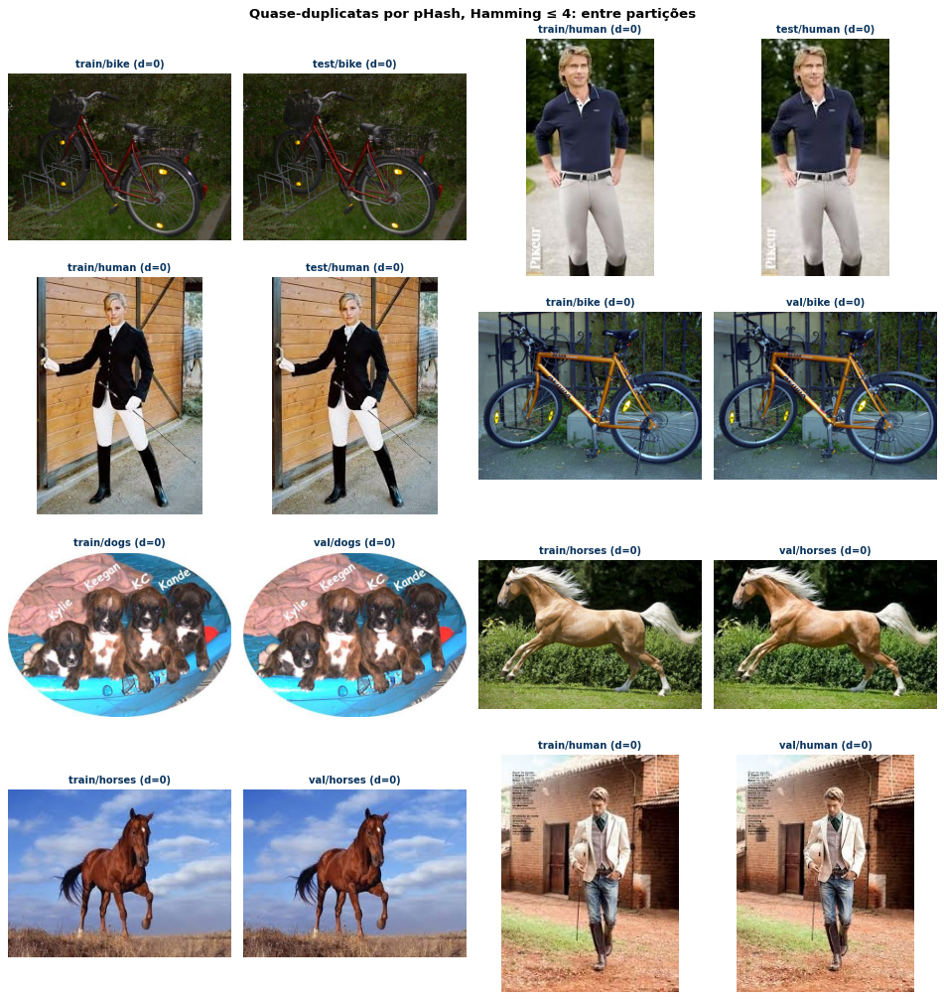

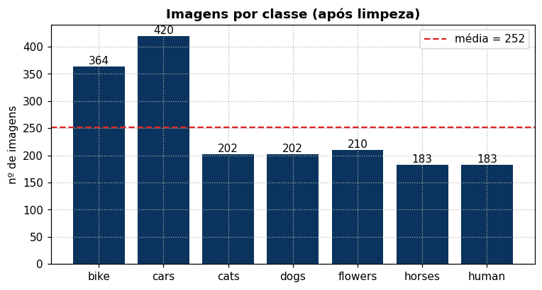

O desbalanceamento é moderado (razão maior/menor de 2,30: cars 420 vs horses/human 183). Não usei pesos de classe; a avaliação por classe e o macro-F1 mostram se as classes menores sofrem (não sofreram).

A observação mais importante da EDA é que **formato, resolução e classe estão amarrados**:

| Classes | Formato | Modo | Tamanho |
|---|---|---|---|
| bike, cars | BMP | RGB | 640×480 (todas) |
| flowers | PNG | **RGBA (210/210)** | **128×128 (todas)** |
| cats, dogs, horses, human | JPEG | RGB | variável |

Só as flowers têm canal alfa. Elas passam por uma composição sobre fundo branco antes da conversão para RGB, mas medi o alfa: **as 210 são 100% opacas** (0% de pixels com A < 255). A composição não muda nenhum pixel, e o canal alfa não carrega sinal. A grade também mostra que bike e cars são cenas de rua com o objeto muitas vezes pequeno, que human é quase só de cavaleiros com roupa de equitação e que horses mistura fotos, desenhos e imagens em tons de cinza.

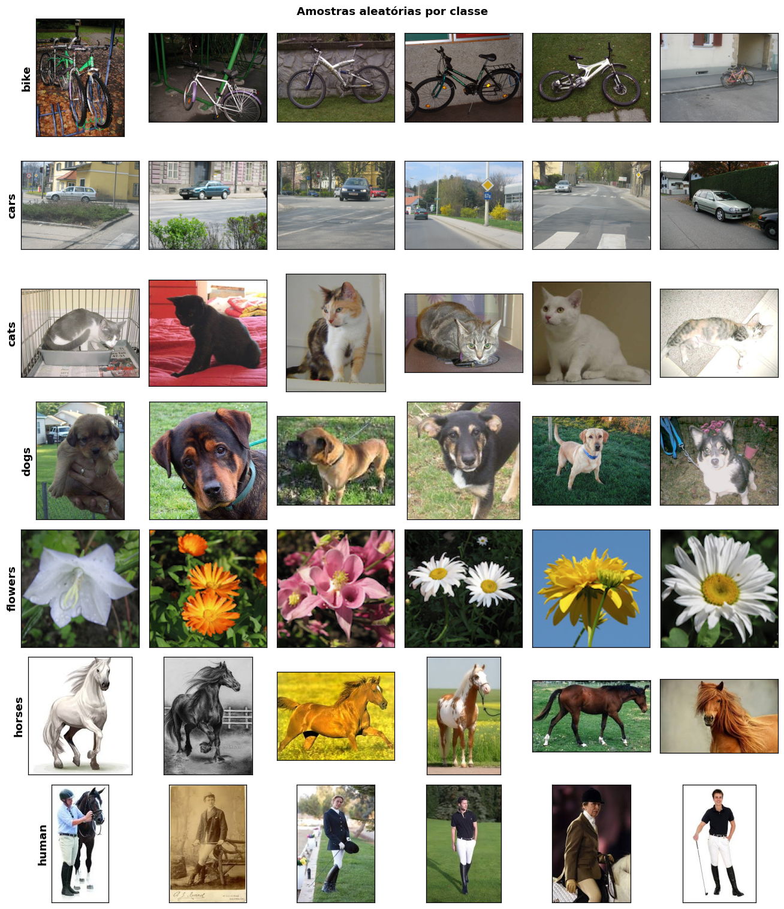

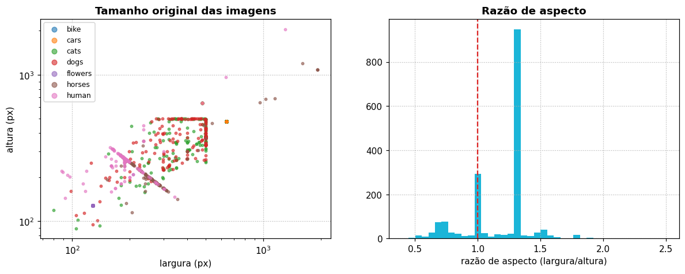

### Decisões e justificativas

**Modelo: EfficientNet-B0 (`IMAGENET1K_V1`), rubrica 1.5.** Candidatas: EfficientNet-B0 (Tabela 12-3 da Aula 1) e ResNet-50. A EfficientNet-B0 tem 5,3 M parâmetros e 0,39 GFLOPs contra 25,6 M e 4,09 GFLOPs da ResNet-50, top-1 no ImageNet de 77,7% (ResNet-50 V1: 76,1%; V2: 80,9%) e um head de 1280·7 + 7 = **8.967** parâmetros (ResNet-50: 14.343). Medi o pico de VRAM e o tempo por passo das duas, congeladas e em fine-tuning completo, com batch 64 sintético na T4:

| Modelo | Modo | Params treináveis | ms/passo | VRAM pico (alocada) |
|---|---|---|---|---|
| EfficientNet-B0 | feature extraction | 8.967 | **67,6** | **707 MB** |
| EfficientNet-B0 | fine-tuning completo | 4.016.515 | 276,7 | 5.550 MB |
| ResNet-50 | feature extraction | 14.343 | 162,7 | 783 MB |
| ResNet-50 | fine-tuning completo | 23.522.375 | 585,0 | 5.611 MB |

Congelar o backbone corta ~86–87% do pico de VRAM nas duas redes, na mesma ordem dos ~84% que o slide 15 da Aula 1 atribui às ativações. Tudo cabe na T4 (14,56 GB), então a VRAM não decide entre as duas redes neste dataset. O que decide é o custo por passo: em FE a EfficientNet-B0 é 2,4× mais rápida que a ResNet-50, com qualidade de features comparável. Uma observação que eu não esperava: em FT completo a EfficientNet-B0 usa quase a mesma VRAM da ResNet-50 e é só 2,1× mais rápida, apesar de ter ~10× menos FLOPs. As convoluções *depthwise* e a expansão dos blocos MBConv geram muitos mapas de ativação e têm baixa intensidade aritmética na GPU, então FLOPs não medem custo de treino.

**Pré-processamento.** `weights.transforms()` (resize 256 bicúbico, center crop 224, normalização ImageNet), a "Regra de Ouro" do slide 16. Sem augmentation no treino, por decisão do projeto (D8 em `docs/decisoes.md`: treino único com `weights.transforms()`, como no código da Aula 1); a augmentation é discutida por escrito (rubrica 1.3).

**Feature extraction, rubrica 1.1.** Todo o backbone com `requires_grad=False` e `classifier[1]` trocado por `Linear(1280, 7)`: 8.967 parâmetros treináveis de 4.016.515 (0,22%). O notebook verifica com asserções que só `classifier.1.weight` e `classifier.1.bias` recebem gradiente. O backbone fica sempre em `eval()`, para que o BatchNorm não atualize as médias móveis e o *Stochastic Depth* não descarte blocos, e só o head entra em `train()` (dropout 0,2). No fim do treino, o `state_dict` do backbone (pesos e estatísticas do BN) é comparado com o snapshot anterior: idêntico.

**Treino.** AdamW (lr 1e-3, weight decay 1e-4) só no head, `CosineAnnealingLR` em 15 épocas, batch 64 e early stopping pela loss de validação (paciência 4).

### Resultados, rubrica 1.2

| Métrica | Valor |
|---|---|
| Accuracy no teste | **99,25%** (263/265), IC 95% de Wilson [97,3%; 99,8%] |
| Macro-F1 no teste | **0,9929** |
| Accuracy na validação (melhor época) | 99,62% (264/265) |
| Melhor época / épocas rodadas | 15 / 15 |
| Tempo de treino / VRAM de pico | 142,7 s / 723 MB alocados (1.264 MB reservados) |
| RAM de pico | 1.947 MB no processo principal + 1.326 MB no maior worker do DataLoader |
| Teste limpo (sem as 3 quase-duplicatas do treino) | 99,24% (260/262), macro-F1 0,9928 |

| Classe | n teste | Accuracy | IC 95% (Wilson) |
|---|---|---|---|
| bike | 54 | 98,1% | [90,2%; 99,7%] |
| cars | 63 | 100% | [94,3%; 100%] |
| cats | 30 | 96,7% | [83,3%; 99,4%] |
| dogs | 31 | 100% | [89,0%; 100%] |
| flowers | 32 | 100% | [89,3%; 100%] |
| horses | 28 | 100% | [87,9%; 100%] |
| human | 27 | 100% | [87,5%; 100%] |

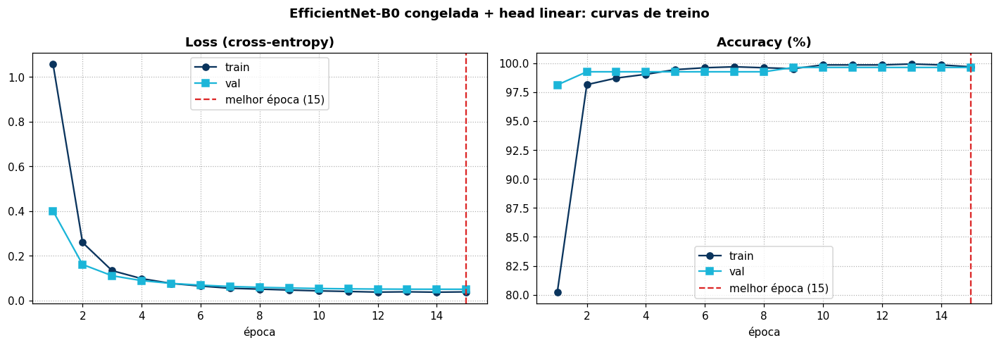

**Curvas.** Depois de uma época a val acc já é 98,1%; fica em 263/265 nas épocas 2–8 e em 264/265 nas épocas 9–15, sem nunca voltar atrás. A loss segue caindo (val 0,40 → 0,05), o que indica que o head fica mais confiante nas imagens que já acertava. Não há overfitting: nas primeiras épocas a loss de treino fica acima da de validação (média ao longo da época e dropout ativo só no treino), e no fim o gap é pequeno (0,038 vs 0,050). A melhor época foi a última, e o early stopping não disparou porque a val loss melhorou em todas as épocas, por pouco no fim (0,0517 → 0,0499 nas últimas cinco), com o *cosine* levando a LR a 1e-5. A loss ainda não convergiu. Mais épocas ou LR maior a reduziriam, mas com os dados já ~linearmente separáveis isso aumentaria sobretudo a confiança das predições, com ganho em accuracy de no máximo uma imagem de validação.

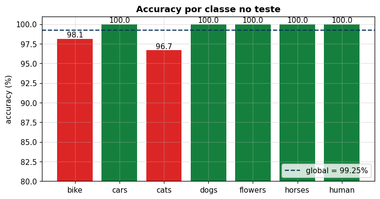

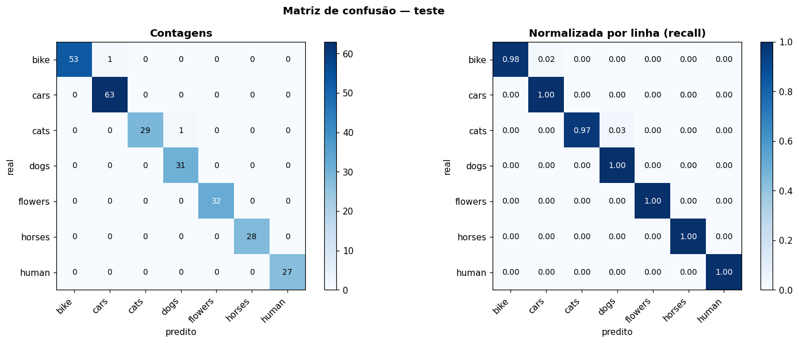

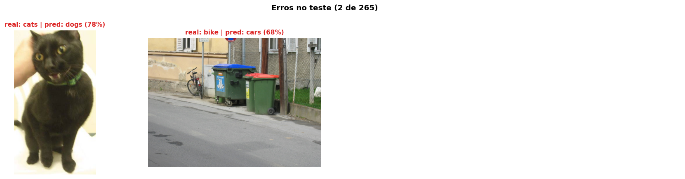

**Erros.** Os dois erros têm confiança abaixo de 80%:

- **cats → dogs (78%)**: gato preto em retrato (282×499), com a mão de uma pessoa e uma coleira. A figura mostra, ao lado do original, a entrada real do modelo: o resize para 256×453 e o center crop 224 mantêm só a faixa central da altura (~25% a ~75%), e **olhos e orelhas ficaram de fora**; sobraram a boca, a mão, a coleira e o corpo. Que o corte do rosto e a coleira tenham causado o erro é hipótese; não foi testado (p.ex. reclassificando a imagem inteira com *padding*).
- **bike → cars (68%)**: bicicleta pequena, encostada num muro, numa cena dominada por contêineres e asfalto, sem nenhum carro. Aqui o crop não cortou a bicicleta, que aparece inteira na entrada do modelo. Como bike e cars vêm da mesma coleção de cenas de rua, **minha hipótese** é que o head usa em parte o contexto "rua → cars" e que, com o objeto pequeno, o contexto pesa mais; isso só se confirma com Grad-CAM.

Não há relação entre o tamanho da classe e os erros: cars (a maior) e horses/human (as menores) acertaram tudo.

**Vazamento por quase-duplicata.** No teste limpo (262 imagens) a accuracy é 99,24% e o macro-F1 0,9928, contra 99,25% e 0,9929 no teste completo. As 3 imagens com cópia no treino foram acertadas, mas os dois erros não estão entre elas, então as cópias não inflam o resultado de forma mensurável.

### Análise crítica

**O teste tem pouca resolução.** Com 2 erros em 265, o IC de 95% da accuracy global vai de 97,3% a 99,8%, e 1 erro vale 3,3 p.p. em cats. Os 100% por classe só dizem que a accuracy real provavelmente passa de ~88–94%. Qualquer melhoria (augmentation, fine-tuning, outro backbone) pode ganhar no máximo 2 imagens (+0,75 p.p.), dentro do intervalo, e o teste não consegue mostrá-la.

**Risco de *shortcut* ligado à aquisição.** Como formato e resolução estão amarrados à classe, o head pode separar flowers por serem as únicas imagens ampliadas 2× (mais borradas, sem blocos JPEG) e bike/cars por serem cenas de rua 640×480, e não pelo conteúdo (Geirhos et al., 2020). O 100% em flowers tem duas explicações, a semântica (é a única classe vegetal e o ImageNet tem classes de flores) e a do atalho, e as duas preveem 100% porque o teste vem da mesma fonte. O canal alfa já foi descartado como pista (100% opaco), então o atalho possível é de resolução e compressão, e continua sendo hipótese. O erro bike → cars é compatível com um atalho de contexto "rua → cars", também hipótese. Os dois erros ficam dentro de um mesmo grupo de formato (BMP; JPEG), o que é compatível com as duas hipóteses. Os testes que eu faria para separá-las:

1. ~~medir a fração de pixels com alfa < 255 nas flowers~~: feito, 0% (alfa descartado como pista);
2. troca contrafactual: reduzir para 128×128 PNG imagens de teste de outras classes e recomprimir as flowers em JPEG, e contar quantas predições mudam;
3. baseline só com metadados (largura, altura, formato), para mostrar que o vazamento existe nos dados;
4. Grad-CAM no último bloco (`features[8]`), para ver se a ativação cai nas pétalas, no rosto e na bicicleta ou no fundo e nas bordas;
5. teste externo com 30–50 imagens por classe de outra fonte, a única medida de generalização de verdade.

**Data augmentation, rubrica 1.3.** Recomendo cinco estratégias, justificadas pelas classes (as mesmas da seção 8 do notebook):

| Estratégia | Por que ajuda | Onde pode prejudicar |
|---|---|---|
| Flip horizontal | Poses de animais, pessoas e veículos; nenhuma classe depende de esquerda/direita | Nenhuma classe |
| `RandomResizedCrop(scale=(0.6, 1.0))` | Escalas muito variadas; no erro cats → dogs o crop fixo tirou olhos e orelhas do gato | Com `scale` pequeno: bike/cars (recorte sem o objeto, como na cena do erro bike → cars) e cats/dogs/horses (recorte sem a cabeça) |
| `ColorJitter` leve (brilho/contraste 0,2; saturação 0,1; sem matiz) | Exposição variada (o gato do erro está sobre fundo estourado) | flowers com matiz/saturação fortes; cor da pelagem em cats/dogs/horses |
| Redução para 96–160 px + JPEG q 60–95 em todas as classes (p ≈ 0,3) | Iguala as assinaturas de aquisição (flowers 128 px PNG; bike/cars BMP) e ataca o possível atalho | Nenhuma nessa intensidade |
| Rotação pequena (±10°) | Fotos levemente inclinadas | Nenhuma nessa faixa; rotações grandes prejudicam todas as classes exceto flowers |

Descartei o *flip* vertical e as rotações grandes (todas as classes exceto flowers têm orientação dada pela gravidade), matiz forte e *grayscale* frequente (a cor é pista forte em flowers), recortes agressivos (`scale` a partir de 0,08) e normalização com estatísticas do próprio dataset, que quebraria a calibração do backbone congelado. A figura abaixo ilustra essas transformações em imagens do dataset. Nenhuma delas foi usada no treino.

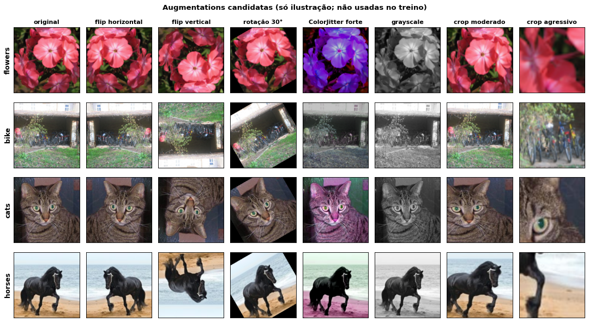

**Feature extraction vs fine-tuning, rubrica 1.4.** A decisão depende do tamanho do dataset e da distância até o ImageNet. Aqui as duas coisas apontam para FE: as classes são objetos do cotidiano bem cobertos pelo ImageNet, e 1.234 imagens de treino para ~4,0 M de parâmetros no backbone dariam ~3.200 parâmetros por imagem num FT completo, com risco alto de overfitting e de *catastrophic forgetting*. Os números confirmam: o head sozinho chegou a 99,25%, e o FT custaria 7,9× a VRAM e 4,1× o tempo por passo para ganhar no máximo 2 imagens. Há um argumento a mais: o FT daria ao backbone liberdade para se adaptar às assinaturas de aquisição acima, enquanto as features congeladas limitam esse espaço. O FT compensaria num domínio distante (as texturas de aço da A1) ou se o teste externo mostrasse queda forte. Nesse caso eu começaria com a augmentation de resolução com o backbone congelado e, só depois, faria o FT parcial de `features[7:]` com LR diferencial (1e-5 no backbone, 1e-3 no head; Aula 1, nb[21]), partindo do head já treinado, como recomenda a Aula 6 (slide 12).

### O que eu mudaria

1. **Avaliação**: um teste externo de outra fonte e um teste de estresse (imagens reduzidas, recomprimidas, com crop descentralizado), mais os testes contrafactuais de aquisição. O teste atual está saturado.
2. **Pré-processamento na inferência**: redimensionar sem cortar (*padding* até quadrado) ou usar TTA com vários recortes, para não perder rostos e objetos na borda, como no erro cats → dogs.
3. **Treino**: pré-computar as features uma vez (sem augmentation elas são iguais em todas as épocas), o que tiraria o treino do head de ~9,5 s para menos de 1 s por época; usar `min_delta` no early stopping.
4. **Incerteza**: reportar IC em todas as métricas e medir a calibração (*reliability diagram*, ECE). Os dois erros tiveram confiança abaixo de 80%, e uma opção de rejeição pode ser útil.
5. **Explicabilidade**: Grad-CAM nas classes suspeitas de atalho (flowers, bike/cars).

### Referências

- Geirhos, R., Jacobsen, J.-H., Michaelis, C., Zemel, R., Brendel, W., Bethge, M., & Wichmann, F. A. (2020). Shortcut Learning in Deep Neural Networks. *Nature Machine Intelligence*, 2, 665–673.
- He, K., Zhang, X., Ren, S., & Sun, J. (2016). Deep Residual Learning for Image Recognition. *CVPR*.
- Selvaraju, R. R., Cogswell, M., Das, A., Vedantam, R., Parikh, D., & Batra, D. (2017). Grad-CAM: Visual Explanations from Deep Networks via Gradient-Based Localization. *ICCV*.
- Tan, M., & Le, Q. V. (2019). EfficientNet: Rethinking Model Scaling for Convolutional Neural Networks. *ICML*.
- Wilson, E. B. (1927). Probable Inference, the Law of Succession, and Statistical Inference. *Journal of the American Statistical Association*, 22(158), 209–212.
- Géron, A. (2025). *Hands-On Machine Learning with Scikit-Learn and PyTorch*. O'Reilly, cap. 12 (data augmentation; modelos pré-treinados para transfer learning).
- Material da disciplina: Aula 1 (slides 14–17: Tabela 12-3, VRAM de treino, Weights Enum API, feature extraction vs fine-tuning; notebook `aula_01_cnn_architectures.ipynb`, nb[14], nb[16] e nb[21]) e Aula 6 (slide 12: linear probe vs fine-tuning).

## A4.1 — Estudo de caso: triagem de COVID-19 em raio-X de tórax com cGAN para augmentation sintética

### Cenário e objetivo

Um grupo anterior treinou uma ResNet-18 do zero para triar radiografias de tórax em Normal / Pneumonia / COVID-19, com 1.200 imagens na proporção 7:2:1 (840/240/120), split 80/20, SGD com LR fixo 0,01 e 15 épocas, sem augmentation, e relatou só a accuracy (93% no treino, 61% na validação). Este notebook (1) diagnostica os problemas metodológicos desse projeto e o impacto clínico de cada um; (2) reproduz o baseline e constrói um pipeline corrigido; (3) treina uma **GAN condicional (cGAN)** para gerar radiografias COVID sintéticas, documentando a instabilidade do treino adversarial e sua mitigação; (4) mede, com várias seeds, se os sintéticos melhoram o **recall de COVID** num teste 100% real; (5) propõe um plano de melhoria com critério de adoção clínica. Notebook: `notebooks/A4_estudo_caso_raio_x.ipynb`, executado com "Executar tudo" numa T4 do Colab em **809,5 s (~13,5 min)**; VRAM de pico 3.274 MB.

### Diagnóstico do projeto anterior

| # | Problema | Impacto clínico |
|---|---|---|
| 1 | Desbalanceamento 7:2:1 não tratado | Falsos negativos de COVID: paciente infectado é liberado como "normal" |
| 2 | Split 80/20 sem estratificação, sem teste separado | O recall que embasaria a decisão de implantar não se reproduz |
| 3 | Só accuracy global | Ninguém sabe quantos COVID escaparam nem quantos alarmes falsos houve |
| 4 | ResNet-18 sem pré-treino com 1.200 imagens | Features frágeis, decoram o treino, usam atalhos |
| 5 | Overfitting (93%×61%) sem regularização | Modelo final pior que o melhor já alcançado no treino |
| 6 | Sem augmentation | Pouca robustez a variações rotineiras de aquisição |
| 7 | SGD com LR fixo, 15 épocas arbitrárias | Resultado não reprodutível entre seeds |
| 8 | Vazamento por paciente e viés de fonte | Falha silenciosa em produção; o modelo pode aprender a fonte, não a doença |

**Confirmação numérica.** Prever "Normal" para tudo já dá **70,0%** de accuracy na distribuição enviesada de desenvolvimento (acima dos 61% de validação e abaixo dos 93% de treino do relatório do grupo) — o paradoxo da acurácia direto — mas só **33,3%** de accuracy balanceada e **0% de recall de COVID** num teste equilibrado. Reproduzindo a receita do grupo (seção seguinte): treino 100%, validação aleatória 89,6% (um número que parece bom), mas **teste 70,5%**, com recall de COVID de apenas **23,5%** — a validação, embaralhada na mesma distribuição enviesada do treino, não expôs o problema.

### Dados

`tawsifurrahman/covid19-radiography-database`: COVID 3.616, Normal 10.192, Viral Pneumonia 1.345 arquivos (Lung_Opacity ignorada, fora do escopo). Após MD5 (**54 duplicatas exatas removidas, nenhuma cruzando classes**) e pHash (Hamming ≤ 4, mais permissivo: **31 rejeições adicionais**, 18 em COVID e 13 em Normal, das quais **4 cruzando classes/partições** — sem essa checagem, até 4 radiografias quase idênticas poderiam aparecer em dev e teste ao mesmo tempo).

**Confusão classe × fonte, confirmada.** Pneumonia vem de **uma única fonte** (`paultimothymooney/chest-xray-pneumonia`, 440 imagens, o repositório pediátrico de Guangzhou); Normal vem de duas fontes (RSNA 893, o mesmo repositório pediátrico 147); COVID vem de **6 fontes** (BIMCV 217, Eurorad 23, COVID-CXNet 43, ieee8023 17, ml-workgroup 12, SIRM 8), cada uma com seu equipamento e faixa etária. O modelo pode estar aprendendo a fonte, não a doença; como o teste vem dos mesmos repositórios do treino, o desempenho medido aqui é um **limite superior** do que se veria num hospital novo.

**Brilho médio** (atalho possível): COVID 139,7 ± 26,7, Normal 129,8 ± 22,3, Pneumonia 127,9 ± 18,4 — COVID é ~10-12 unidades mais claro em média, pequeno frente ao desvio de cada classe, mas coerente com o viés de fonte/equipamento.

**Grade 64 px** (decisão anti-atalho: reduz o texto sobreposto a ilegível): mantém forma do tórax, silhueta cardíaca, clavículas e dispositivos grandes; perde opacidades finas em vidro fosco — a marca radiológica mais discutida do COVID — e textura fina do parênquima.

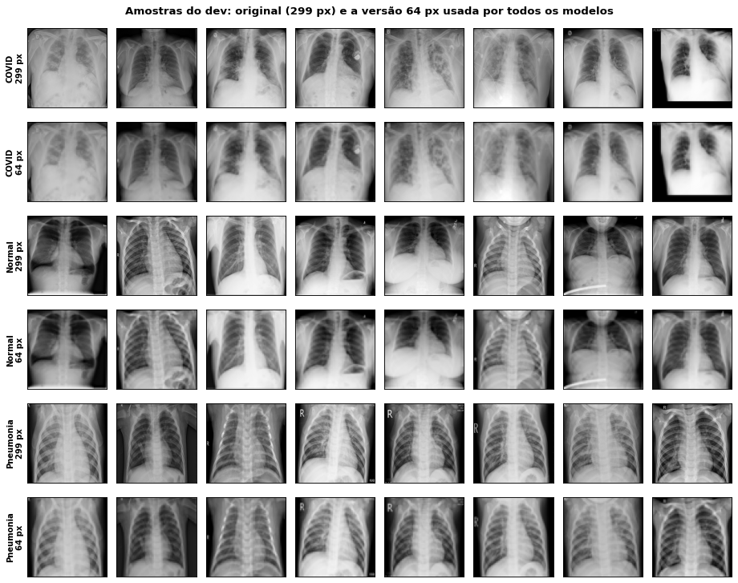

### Baseline vs. pipeline corrigido

| | Baseline (receita do grupo) | Pipeline corrigido |
|---|---|---|
| Pré-treino | Não (do zero) | ImageNet |
| Otimizador | SGD, LR 0,01 fixo | AdamW, cosseno, *warmup* |
| Augmentation | Não | Sim (rotação, zoom, deslocamento, brilho/contraste) |
| Pesos de classe | Não | Sim |
| Seleção de época | Última (15) | Melhor macro-F1 val, *patience* 7 |
| **Accuracy teste** | 70,5% | **87,5%** |
| **Macro-F1 teste** | 0,665 | **0,874** |
| **Recall COVID teste** | 23,5% (47/200) | **67,5%** (135/200) |
| IC 95% (Wilson) do recall | — | **[60,7%; 73,6%]** |
| Especificidade COVID | 99,0% | **100%** |
| VPP a 10% de prevalência | 72,3% | **100%** |

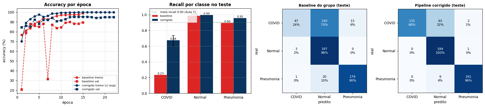

O pipeline corrigido não isola cada correção por ablação — a melhoria é do **pacote completo**; a leitura mais defensável é que pré-treino e pesos de classe atacam os dois problemas mais graves do baseline (features do zero com poucos dados; fronteira deslocada para Normal). **A meta de recall ≥ 0,90 da Aula 7 não foi atingida**: 0,675 no teste, limite inferior do IC (0,607) abaixo até de 0,85. O pipeline corrigido é uma melhoria grande e real, mas **não está pronto para triagem clínica** por esse critério.

### cGAN condicional: instabilidade e mitigação

Duas runs, mesma arquitetura condicional (embedding de classe, ruído 100-d), 250 épocas cada:

**Run A (ingênua).** Sem *spectral norm*, rótulo real = 1,0, LRs iguais (2e-4). Não houve divergência catastrófica (0 iterações não-finitas, sem NaN) nem colapso completo de modo, mas o modo de falha que de fato ocorreu tem nome: **discriminador dominante com gradiente de gerador evanescente, mais *overfitting* do D**. Na época final, D(x) = 0,847 (perto de 1: o D reconhece as reais com confiança alta) contra D(G(z₁)) = 0,169 e D(G(z₂)) = 0,036 (perto de 0: o D rejeita as sintéticas com quase certeza) — o gradiente que chega ao G nessa região da sigmoide é pequeno (gradiente evanescente), e é por isso que loss_G termina em **4,40**, bem acima da Run B (1,30). O **gap de *overfitting* do D** cresce de −0,04 (época 1) a um pico de **0,70** (época 225, fecha em 0,55 na 250). O **KID (com desvio) melhora até a época 150 (0,288 ± 0,010) e piora até o fim (0,296 ± 0,010)**; o piso de referência (KID entre duas amostras de reais, treino vs. referência) é **−0,0003 ± 0,0012** (média ± desvio, ~0 como esperado), então mesmo o melhor ponto da Run A fica duas ordens de grandeza acima de "indistinguível de real". A diversidade (LPIPS) sobe até a época 100 (0,337) e cai ~13% até o fim (0,292) — um enfraquecimento real, não um colapso total.

**Run B (mitigada: *spectral norm* + *label smoothing* 0,9 + TTUR 4×, mesmo modo de falha, bem mais fraco).** loss_D = 1,10, loss_G = 1,30 (contra 0,41/4,40 da Run A). Pelo critério da aula (D(x) > 0,6 e D(G(z)) subindo de ~0 para 0,3–0,5), a Run B chega perto mas não cumpre nenhum dos dois: D(x) = 0,550 fica logo abaixo de 0,6, e D(G(z₂)) = 0,286 fica logo abaixo de 0,3 — o D ainda vence, mas por margem bem menor, e sem o gradiente evanescente da Run A (D(G(z)) não fica preso perto de 0, como estava em 0,036 na Run A). O gap de *overfitting* do D fica pequeno o treino todo (entre −0,05 e **0,11**, contra o pico de 0,70 da Run A). O **KID melhora monotonicamente até o fim** (0,264 ± 0,010 na época 250, contra 0,296 ± 0,010 da Run A na mesma época) — sem a piora tardia da Run A, embora o mesmo piso de referência (−0,0003 ± 0,0012) mostre que ainda há uma distância grande até "indistinguível". A diversidade (LPIPS 0,307 na época 250) fica na mesma ordem de grandeza da Run A, mas sem o enfraquecimento no fim do treino. Não houve ablação fator a fator: a melhoria é do **pacote das três mitigações**, não atribuível a uma só.

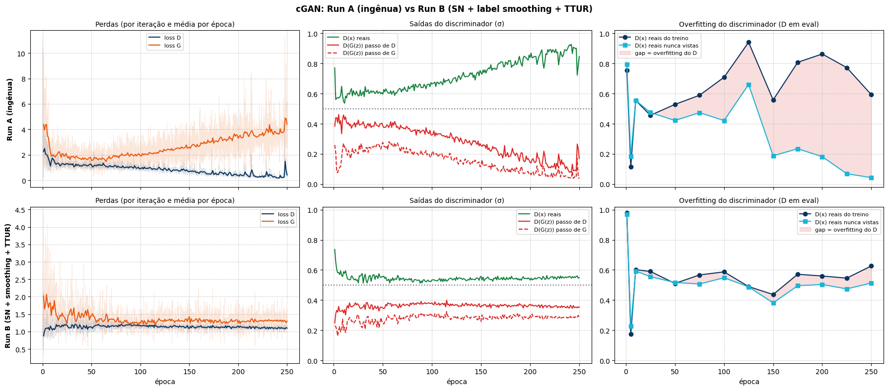

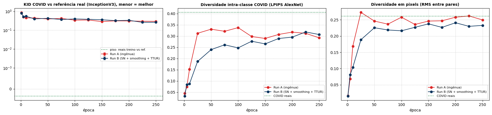

### Qualidade, condicionamento e memorização das sintéticas

| | Run A | Run B |
|---|---|---|
| KID — COVID / Normal / Pneumonia | 0,282 / 0,379 / 0,444 | **0,268 / 0,362 / 0,368** |
| FID (COVID, comparativo) | 261,8 | **250,6** |
| Condicionamento COVID | 0,987 | **1,000** |
| Condicionamento Normal | 0,0067 | 0,0033 |
| Condicionamento Pneumonia | **0,780** | 0,203 |
| Razão de memorização (NN sint./NN real) | 0,970 | 0,972 |
| Fração de sintéticas mais próximas do treino que qualquer real | 0,0 | 0,0 |

A Run B melhora o KID nas 3 classes (mais em Pneumonia), mas **piora bastante o condicionamento de Pneumonia** (0,78 → 0,20) — um *trade-off* real que o KID sozinho não mostra. **Normal é o pior condicionamento nas duas runs** (perto de zero). A leitura direta é que o gerador não captura bem a ausência de opacidade que define "normal" — mas há uma explicação alternativa não descartada: como o controle real×sintético (abaixo) dá AUC 1,00, o classificador usado para medir condicionamento (que pondera COVID em ~3,3×) pode rotular qualquer imagem "com cara de sintética" como COVID, inflando o condicionamento de COVID às custas de Normal/Pneumonia. Não foi medida a distribuição completa de predições das sintéticas de Normal/Pneumonia, o que distinguiria as duas hipóteses — fica como limite da análise. A razão de memorização perto de 1,0 e a fração 0,0 de sintéticas "cópia" descartam decoreba do treino.

**Controle real vs. sintético: AUC = 1,00 ± 0,00** (300 por classe, com uma regressão logística sobre features do Inception e com uma CNN pequena treinada direto sobre os pixels). Separação **perfeita** nos dois métodos — alerta forte de atalho: um classificador treinado com as duas populações juntas pode aprender "cara de sintético" em vez da doença.

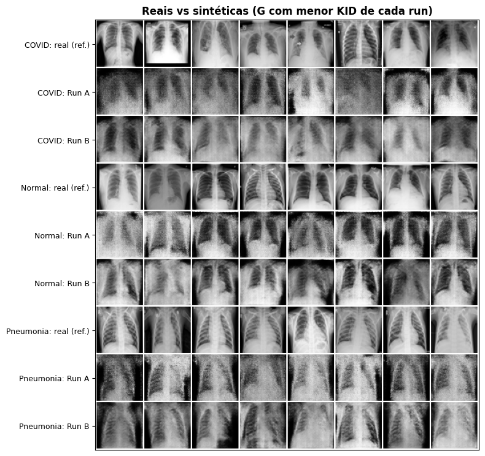

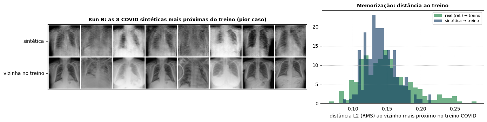

### Com vs. sem sintéticos: o experimento decisivo

*Sweep* com multiplicadores 0×/1×/3× de sintéticos COVID sobre o treino real (96 imagens), 3 seeds cada, pipeline corrigido:

| Multiplicador | Recall COVID (média ± desvio, 3 seeds) | Macro-F1 |
|---|---|---|
| 0× (só reais) | **72,3% ± 4,5** | 0,885 ± 0,010 |
| 1× (+96 sintéticas) | 66,5% ± 3,9 | 0,867 ± 0,012 |
| 3× (+288 sintéticas) | 66,3% ± 4,3 | 0,860 ± 0,023 |

A média do recall **cai** com sintéticos. A diferença pareada (1×−0×) tem IC 95% t (gl=2) de **[−22,0; +10,4] p.p.** e (3×−0×) de **[−15,4; +3,4] p.p.** — os dois incluem zero, mas o McNemar por seed revela a tendência: em 1×, 2 das 3 seeds pioram de forma significativa (p=0,014 e p=0,0016); em 3×, 1 de 3 (p=0,0055). **Nenhuma seed melhora de forma significativa.**

Precisão e especificidade de COVID **sobem** (não descem) com sintéticos (98,7%→99,5%→99,0%), enquanto o recall cai — o oposto do que um deslocamento de fronteira "para COVID" previria. A leitura mais provável: os sintéticos **diluem** o sinal de treino, gastando capacidade do modelo em características do COVID sintético que não transferem para o COVID real do teste — coerente com o AUC de 1,00 do controle real-vs-sintético. O ponto 0× já treina com pesos de classe; os sintéticos não têm ganho incremental sobre o que os pesos já entregam.

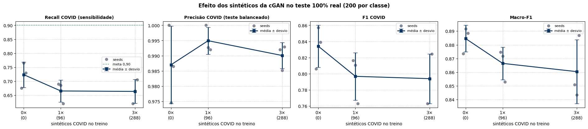

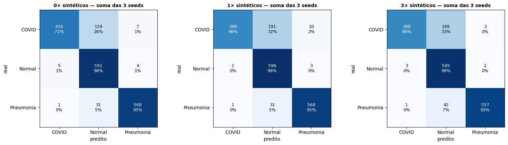

**Conclusão honesta.** Neste experimento (3 classes, 64 px, pipeline já corrigido, 3 seeds), a GAN **não ajudou** — há indícios reais, embora não conclusivos na média de 3 seeds, de que **atrapalhou** o recall de COVID. Contrasta com a Aula 7 (+13 p.p., 1 seed): a diferença mais provável é o número de seeds, não o pipeline — um único treino pode acertar por sorte de inicialização/split.

### Plano de melhoria e critério de adoção clínica

Priorização guiada pelos resultados: com o recall do corrigido em 67,5% (abaixo da meta 0,90) e a GAN sem ganho no sweep, o gargalo **não é validação externa ainda** — é fechar a distância até a meta no próprio teste interno.

1. **Subir a resolução de entrada** (224–512 px, com ou sem GAN retreinada na mesma resolução) — o teto mais provável, pela perda de opacidades finas em 64 px.
2. **Auditar e mitigar atalhos de fonte** — Pneumonia de uma única fonte, COVID de 6, é confusão classe × fonte real, não hipotética.
3. **Reduzir a variância entre seeds** (desvio de ±4-5 p.p. no recall) — ensemble ou *test-time augmentation*.
4. **GAN/sintéticos pausados**: não adotar nesta configuração — Δ recall médio −5,8 p.p. (1×) e −6,0 p.p. (3×), sem ganho e com o controle real-vs-sintético falhando o pré-requisito de AUC baixo (deu 1,00).
5. Só depois de bater a meta de sensibilidade no teste interno, calcular a amostra para teste externo: **92 a 127 casos COVID confirmados**, dependendo da sensibilidade real, para que o limite inferior do IC fique acima de 0,85–0,90.

Critério de adoção clínica proposto (a validar com o time clínico): sensibilidade ≥ 0,90 com IC 95% inferior ≥ 0,85; especificidade ≥ 0,80 na prevalência local; calibração (ECE ≤ 0,05); humano no *loop* (o modelo prioriza a fila, não decide sozinho); estudo prospectivo silencioso antes de qualquer uso; monitoramento pós-implantação com auditoria mensal e plano de *rollback*.

### Referências

- Dumakude, A., & Ezugwu, A. E. (2023). Automated COVID-19 detection with convolutional neural networks. *Scientific Reports*, 13, 10607, https://www.nature.com/articles/s41598-023-37743-4 — cenário e dataset de referência deste estudo de caso.
- Mirza, M., & Osindero, S. (2014). Conditional Generative Adversarial Nets. *arXiv:1411.1784*.
- Radford, A., Metz, L., & Chintala, S. (2016). Unsupervised Representation Learning with Deep Convolutional Generative Adversarial Networks (DCGAN). *ICLR*.
- Miyato, T., Kataoka, T., Koyama, M., & Yoshida, Y. (2018). Spectral Normalization for Generative Adversarial Networks. *ICLR*.
- Salimans, T., Goodfellow, I., Zaremba, W., Cheung, V., Radford, A., & Chen, X. (2016). Improved Techniques for Training GANs (*one-sided label smoothing*). *NeurIPS*.
- Heusel, M., Ramsauer, H., Unterthiner, T., Nessler, B., & Hochreiter, S. (2017). GANs Trained by a Two Time-Scale Update Rule Converge to a Local Nash Equilibrium (**TTUR**, FID). *NeurIPS*.
- Bińkowski, M., Sutherland, D. J., Arbel, M., & Gretton, A. (2018). Demystifying MMD GANs (KID). *ICLR*.
- Zhang, R., Isola, P., Efros, A. A., Shechtman, E., & Wang, O. (2018). The Unreasonable Effectiveness of Deep Features as a Perceptual Metric (LPIPS). *CVPR*.
- Material da disciplina: Aula 7 (`aula_07_gans_generative_adversarial_networks.ipynb`, cGAN + comparação de recall; `aula_07_dcgan_cifar10_treinamento.ipynb`, diagnóstico de treino).

### Uso de IA

Notebook (`notebooks/src/A4_estudo_caso_raio_x.py` → `.ipynb`) escrito com Claude Code (`construtor-notebook`): diagnóstico do baseline, EDA com MD5/pHash e tabela de fontes, baseline e pipeline corrigido, cGAN condicional com *spectral norm*/*label smoothing*/TTUR, métricas de qualidade (KID/FID/LPIPS via torch-fidelity e torchmetrics), controle real-vs-sintético, *sweep* com 3 seeds e testes pareados (t, McNemar), plano de melhoria com cálculo de amostra. Análise (`analista-resultados`) escrita a partir do JSON de métricas da execução na T4 (28/09/2026) e das figuras geradas — todos os números deste texto foram conferidos contra `A4_metrics.json`. Verificação humana: pendente de revisão por Gilmar; leituras sobre atalhos de fonte e a causa da queda de recall com sintéticos mantidas como hipótese, apoiadas no controle real-vs-sintético (AUC 1,00) mas não isoladas experimentalmente.

## A4.2 — Transfer Learning para Análise de Tráfego Urbano

### Contexto

O sistema analisado usa uma ResNet-50 (He et al., 2016) pré-treinada no ImageNet (Deng et al., 2009), ajustada com 800 frames rotulados de 12 câmeras urbanas em três classes: *livre*, *moderado* e *congestionado*. Obteve 78% de accuracy na validação, foi implantado e passou a falhar de forma sistemática em chuva, à noite e em câmeras com ângulos que não estavam no treino.

O argumento que justificou o projeto ("o ImageNet reconhece objetos, veículos são objetos, logo as features servem") junta duas tarefas diferentes. O ImageNet treina **reconhecimento de um objeto dominante, em geral centrado, em fotos diurnas feitas por pessoas**. Classificar fluxo pede outra coisa: estimar **densidade e ocupação** de faixas numa cena ampla, com dezenas de veículos pequenos e parcialmente ocultos, e interpretar o **contexto espacial** (quais faixas, que sentido, onde fica a retenção). A mesma avenida cheia de carros pode ser "congestionado" (carros parados) ou "moderado" (carros andando juntos). A diferença está no movimento, e um frame isolado não mostra movimento. Yosinski et al. (2014) mostraram que as camadas finais de uma CNN são as mais específicas da tarefa de origem e as que transferem pior quando as tarefas se afastam.

A referência indicada no enunciado (Meegle) trata dos desafios gerais de transfer learning em análise de tráfego. Esta análise se apoia na literatura citada abaixo.

### Problemas identificados

#### P1. *Domain shift* e *task shift* do ImageNet para o fluxo

**Descrição técnica.** As features de alto nível da ResNet-50 codificam "o que é o objeto". A tarefa exige "quantos, onde e se estão parados". Com 800 imagens, o fine-tuning completo dos ~25 milhões de parâmetros tende a reaproveitar os atalhos mais fáceis que distinguem as classes no treino (iluminação, horário, a própria câmera) em vez de aprender densidade. É o *shortcut learning* (Geirhos et al., 2020), transposto dos "5 problemas técnicos" discutidos na Aula 7 (visão biomédica).

**Impacto operacional.** O modelo acerta enquanto o atalho acompanha o rótulo (por exemplo, "câmera X no fim da tarde = congestionado") e erra quando a correlação se quebra. O operador passa a confiar num indicador que não mede tráfego.

**Como eu abordaria.** (i) Reformular a saída como uma grandeza física: estimar **contagem ou ocupação por faixa** (detector de veículos pré-treinado em dados de tráfego, ou mapa de densidade, como em Zhang et al., 2017) e derivar a classe por limiares. (ii) Se a classificação direta for mantida, comparar *feature extraction* (backbone congelado) com fine-tuning parcial dos últimos blocos, porque com 800 imagens o congelamento reduz o sobreajuste ao fundo da câmera. (iii) Usar Grad-CAM para verificar se a atenção cai sobre faixas e veículos ou sobre céu, prédios e o carimbo de horário.

#### P2. Poucos dados e vazamento entre frames e câmeras no split

**Descrição técnica.** São 800 frames de 12 câmeras, cerca de 67 por câmera. Frames consecutivos da mesma câmera são quase idênticos. Se o split foi aleatório por frame, a validação contém "gêmeos" das imagens de treino, com o mesmo fundo, a mesma iluminação e os mesmos veículos. Os 78% medem então **memorização da cena**, não generalização. É o análogo do vazamento por paciente da Aula 7. Beery et al. (2018) documentaram esse efeito em câmeras fixas (armadilhas fotográficas): o desempenho cai de forma acentuada em locais nunca vistos.

**Impacto operacional.** A decisão de implantar foi tomada com uma estimativa otimista. A accuracy real em câmeras novas é desconhecida e provavelmente bem menor. Foi isso que apareceu em produção.

**Como eu abordaria.** Refazer a avaliação com **split *leave-camera-out*** (validação cruzada agrupada por câmera, *GroupKFold*) e, dentro de cada câmera, blocos temporais separados (dias diferentes, não minutos adjacentes). Deduplicar frames quase idênticos (hash perceptual) antes do split. Com 12 câmeras e ~67 frames cada, o *leave-one-camera-out* gera *folds* pequenos e de alta variância. Por isso o resultado deve ser reportado como **média ± desvio entre *folds***, nunca como um número único. A cifra que vale para a decisão de implantação é a de câmeras não vistas.

#### P3. Cobertura insuficiente de condições (chuva, noite, ângulos)

**Descrição técnica.** A distribuição de entrada em produção difere da de treino (*covariate shift*): faróis e reflexos no asfalto molhado, ruído do sensor à noite, gotas na lente, perspectivas e alturas de montagem diferentes. CNNs treinadas em ImageNet são reconhecidamente frágeis a corrupções como ruído, desfoque, neblina, neve e baixo contraste (Hendrycks & Dietterich, 2019).

**Impacto operacional.** As falhas se concentram nos horários e condições em que o trânsito é mais crítico: pico noturno, chuva forte. Se o sinal alimenta o controle semafórico, um congestionamento não detectado mantém planos semafóricos e rotas recomendadas inadequados e atrasa o despacho de agentes em incidentes.

**Como eu abordaria.** (i) **Coleta direcionada** de frames noturnos, com chuva e de novas câmeras, com rotulação priorizada pelos erros observados. (ii) **Augmentation fotométrica e climática** coerente com o domínio: brilho, gama e contraste, ruído, desfoque de movimento, chuva e neblina sintéticas. Evitar *flips* verticais e rotações grandes, que não ocorrem em câmera fixa; perspectiva leve simula variação de ângulo. (iii) **Adaptação de domínio no nível de pixel com CycleGAN** (Zhu et al., 2017; Aula 7): traduzir frames diurnos rotulados para "noite" e "chuva", preservando a estrutura da cena pela consistência cíclica e herdando o rótulo. A ressalva da Aula 7 vale aqui: o gerador pode **alucinar** ou apagar veículos, então as amostras sintéticas só entram no treino, e o ganho é medido num teste **100% real** das condições-alvo. Alternativa no espaço de features: adaptação adversarial (Ganin & Lempitsky, 2015) com frames não rotulados das câmeras novas. (iv) **Avaliação estratificada** por condição e por câmera.

#### P4. Frame único, sem informação temporal

**Descrição técnica.** Congestionamento é um estado dinâmico, definido por velocidade baixa e fila persistente. Um frame não distingue "parado no sinal vermelho" de "parado por retenção", nem "denso e fluindo" de "denso e travado".

**Impacto operacional.** Se o sinal alimenta o controle semafórico, haverá alarmes falsos a cada ciclo (fila momentânea classificada como congestionamento) e oscilação da classe de um minuto para o outro, o que torna o sinal inútil para controle adaptativo.

**Como eu abordaria.** Usar **sequências curtas** (8 a 16 frames), com optical flow como canal adicional, uma CNN 3D inflada a partir de pesos 2D (Carreira & Zisserman, 2017) ou um *pipeline* **detector + rastreamento** (SORT; Bewley et al., 2016) que produza contagem e velocidade média por faixa. Na saída, suavizar a decisão (janela deslizante ou histerese).

#### P5. Rótulos subjetivos, classes desbalanceadas e métrica única

**Descrição técnica.** A fronteira entre *moderado* e *congestionado* depende de quem rotulou, e cada câmera tem capacidade diferente. Sem critério escrito, o ruído de rótulo se concentra nas classes vizinhas. A classe *congestionado* é provavelmente minoritária, e 78% de accuracy pode esconder recall baixo justamente nela (o "paradoxo da acurácia" da Aula 7). Se, por hipótese, 60% dos frames fossem *livre*, um classificador constante já faria 60%. Além disso, as classes são **ordinais**, e a accuracy trata todos os erros como iguais.

**Impacto operacional.** O erro é assimétrico e depende da distância: classificar *congestionado* como *livre* (nenhuma intervenção) é muito pior do que confundi-lo com *moderado*, e ambos são piores que uma intervenção desnecessária.

**Como eu abordaria.** (i) Definir **critério objetivo** de rótulo por ocupação de faixa e/ou velocidade média, calibrado por câmera, com protocolo escrito e medição de concordância por **kappa ponderado** (ou kappa de Fleiss, se houver mais de dois anotadores). (ii) Reportar **matriz de confusão, recall e F1 por classe e por condição**, macro-F1 e uma métrica ordinal (MAE sobre as classes ou kappa ponderado entre predição e rótulo). (iii) Treinar com perda que respeite a ordem (regressão ordinal ou matriz de custo em que *livre↔congestionado* pesa mais que erros entre vizinhas), tratar o desbalanceamento com ponderação e fixar meta explícita de recall para *congestionado*.

#### P6. Implantação sem monitoramento de *drift* nem de incerteza

**Descrição técnica.** O modelo foi para produção sem detecção de mudança de distribuição, sem limiar de confiança e sem *fallback*. As probabilidades softmax de CNNs modernas costumam ser mal calibradas (Guo et al., 2017), e o sistema erra com alta confiança fora da distribuição. Mudanças físicas (câmera reposicionada, obra, lente suja, estação do ano) alteram a entrada sem aviso.

**Impacto operacional.** As falhas foram descobertas pelos efeitos no trânsito, não por um alerta. Não há como saber quais câmeras estão degradadas, e o erro pode persistir por semanas.

**Como eu abordaria.** (i) **Calibração** (*temperature scaling*) e abstenção: abaixo de um limiar de confiança, a câmera é marcada como "indeterminada" e o sistema volta ao plano semafórico padrão ou a outra fonte de dados. (ii) **Monitoramento por câmera** da distribuição de entrada (brilho, estatísticas de embeddings) e de saída (proporção de classes), com testes de *drift* (Rabanser et al., 2019). (iii) Auditoria amostral com rotulação humana, **retreino** com os casos difíceis e *shadow deployment* antes da troca de modelo (Sculley et al., 2015).

### Riscos do transfer learning ImageNet → classificação de fluxo

1. **Viés do domínio de origem.** O ImageNet é composto de fotos diurnas, bem expostas e centradas no objeto. O pré-treino dá pouca robustez prévia a noite, chuva ou vista oblíqua e fixa estatísticas de baixo nível (cor, textura) que não valem nessas condições.
2. **Convergência rápida não é adequação.** Um backbone forte atinge accuracy alta em poucas épocas e dá aparência de solução pronta. He, Girshick & Dollár (2019) mostram que, com dados e orçamento de treino suficientes, modelos treinados do zero alcançam o mesmo resultado final que os pré-treinados no ImageNet — o pré-treino acelera a convergência, mas não garante o resultado final. Isso é uma ressalva importante ao caso do fluxo: Kornblith et al. (2019) mostram que a accuracy no ImageNet **prediz bem** a qualidade da transferência para a maioria das tarefas de classificação de imagem natural testadas por eles — mas as tarefas mais distantes do domínio de origem (cenas amplas, granularidade fina, textura vs. objeto) são justamente onde essa correlação é mais fraca no próprio estudo deles, e classificar densidade de tráfego a partir de uma cena ampla com dezenas de veículos pequenos é um caso desse tipo. Ou seja, a conveniência de uma accuracy alta rápida não é evidência de que o backbone aprendeu a característica certa para esta tarefa.
3. **Resolução e escala.** A entrada padrão de 224×224 reduz uma cena ampla, e os veículos distantes somem em poucos pixels. Soluções: entrada de resolução maior (a ResNet aceita por ter *global average pooling*), recorte de ROI por faixa e *tiling* da cena.
4. **Esquecimento das features úteis.** Um fine-tuning agressivo com 800 imagens pode destruir as features genéricas de baixo nível (bordas, texturas), que são a parte que realmente transfere (*catastrophic forgetting*). Taxas de aprendizado diferenciadas por camada e descongelamento gradual reduzem esse risco.

A conclusão não é abandonar o transfer learning, e sim escolher **a fonte e a tarefa certas**: backbone pré-treinado em detecção de veículos ou cenas de tráfego, saída física (contagem, ocupação, velocidade) e validação em câmeras e condições nunca vistas.

### Tabela-resumo

| # | Problema | Impacto operacional | Proposta | Prioridade |
|---|---|---|---|---|
| P2 | Vazamento entre frames/câmeras; poucos dados | 78% superestimado; decisão de implantar sem base | Split *leave-camera-out* + blocos temporais; deduplicação; média ± desvio | **Alta** (sem isso nenhuma melhoria é mensurável) |
| P3 | Cobertura de chuva/noite/ângulos (*covariate shift*) | Falhas nos horários mais críticos; semáforos e rotas mal ajustados | Coleta direcionada; augmentation climática; CycleGAN dia→noite/chuva validada em teste real; avaliação estratificada | **Alta** |
| P5 | Rótulos subjetivos, desbalanceamento, só accuracy | Congestionamento não detectado escondido na média | Critério por ocupação/velocidade; kappa ponderado; métricas por classe, condição e ordinais; custo assimétrico | **Alta** |
| P6 | Sem monitoramento de *drift* e incerteza | Erros silenciosos; sem *fallback* | Calibração + abstenção; *drift* por câmera; auditoria e retreino; *shadow deployment* | **Alta** |
| P1 | *Domain/task shift* ImageNet → densidade | Modelo aprende atalhos (câmera, horário) | Reformular como contagem/ocupação; backbone de tráfego; congelamento parcial; Grad-CAM | Média |
| P4 | Frame único, sem tempo | Alarmes falsos por fila de semáforo; classe oscilante | Sequências + optical flow/3D-CNN ou detector + rastreamento; suavização temporal | Média |

A ordem reflete dependências: P2 e P5 definem **como medir**, e sem isso não se sabe se P1, P3 ou P4 melhoraram alguma coisa. P6 protege a operação enquanto o modelo é refeito.

### Referências

- Beery, S., Van Horn, G., & Perona, P. (2018). Recognition in Terra Incognita. *ECCV*.
- Bewley, A., Ge, Z., Ott, L., Ramos, F., & Upcroft, B. (2016). Simple Online and Realtime Tracking. *IEEE ICIP*.
- Carreira, J., & Zisserman, A. (2017). Quo Vadis, Action Recognition? A New Model and the Kinetics Dataset. *CVPR*.
- Deng, J., Dong, W., Socher, R., Li, L.-J., Li, K., & Fei-Fei, L. (2009). ImageNet: A Large-Scale Hierarchical Image Database. *CVPR*.
- Ganin, Y., & Lempitsky, V. (2015). Unsupervised Domain Adaptation by Backpropagation. *ICML*.
- Geirhos, R., Jacobsen, J.-H., Michaelis, C., Zemel, R., Brendel, W., Bethge, M., & Wichmann, F. A. (2020). Shortcut Learning in Deep Neural Networks. *Nature Machine Intelligence*, 2, 665–673.
- Guo, C., Pleiss, G., Sun, Y., & Weinberger, K. Q. (2017). On Calibration of Modern Neural Networks. *ICML*.
- He, K., Girshick, R., & Dollár, P. (2019). Rethinking ImageNet Pre-training. *ICCV*.
- He, K., Zhang, X., Ren, S., & Sun, J. (2016). Deep Residual Learning for Image Recognition. *CVPR*.
- Hendrycks, D., & Dietterich, T. (2019). Benchmarking Neural Network Robustness to Common Corruptions and Perturbations. *ICLR*.
- Kornblith, S., Shlens, J., & Le, Q. V. (2019). Do Better ImageNet Models Transfer Better? *CVPR*.
- Rabanser, S., Günnemann, S., & Lipton, Z. C. (2019). Failing Loudly: An Empirical Study of Methods for Detecting Dataset Shift. *NeurIPS*.
- Sculley, D., et al. (2015). Hidden Technical Debt in Machine Learning Systems. *NeurIPS*.
- Yosinski, J., Clune, J., Bengio, Y., & Lipson, H. (2014). How Transferable Are Features in Deep Neural Networks? *NeurIPS*.
- Zhang, S., Wu, G., Costeira, J. P., & Moura, J. M. F. (2017). FCN-rLSTM: Deep Spatio-Temporal Neural Networks for Vehicle Counting in City Cameras. *ICCV*.
- Zhu, J.-Y., Park, T., Isola, P., & Efros, A. A. (2017). Unpaired Image-to-Image Translation Using Cycle-Consistent Adversarial Networks. *ICCV*.
- Meegle — artigo sobre os desafios gerais de *transfer learning* em análise de tráfego, indicado no enunciado; **não citado diretamente**: o conteúdo da página é carregado via JavaScript e não pôde ser acessado/lido por esta análise (ver `docs/decisoes.md`, 27/09/2026).
- Material da disciplina: Aulas 1 e 6 (*feature extraction* vs. fine-tuning; *catastrophic forgetting*), Aula 7 (GANs; "5 problemas técnicos"; CycleGAN para tradução entre domínios) e Aula 8 (síntese de imagens).

### Uso de IA

Texto redigido com Claude Code (`redator-relatorio`, agente `redator-a42`), a partir do enunciado do estudo de caso e da base de conhecimento das aulas (`docs/base_conhecimento/`): os 6 problemas (descrição técnica, impacto operacional, proposta), os 4 riscos do transfer learning ImageNet → fluxo, a tabela-resumo priorizada e a lista de referências foram gerados e depois revisados por uma segunda passada adversarial (`revisor-rubrica`, agente `revisor-gates`), que apontou a referência Meegle ausente, a citação de Kornblith (2019) usada de forma forçada e a falta desta seção — as três pendências foram corrigidas nesta revisão. Verificação humana: pendente de revisão por Gilmar; não há execução de código nesta atividade (é só análise teórica), então não há números para conferir contra saída nenhuma.

# Uso de ferramentas de IA

Todo o código e a redação deste projeto foram produzidos com **Claude Code** (Anthropic), usando um time de agentes especializados definidos em `.claude/agents/`: `pesquisador-aulas` (destilou o material das 8 aulas em `docs/base_conhecimento/`), `construtor-notebook` (escreveu e corrigiu os notebooks), `analista-resultados` (interpretou as saídas executadas e escreveu as análises), `redator-relatorio` (textos sem GPU e montagem deste documento) e `revisor-rubrica` (auditoria adversarial, só leitura, contra a rubrica e as convenções do projeto). Cada atividade tem sua própria subseção "Uso de IA" com o detalhe do que foi gerado e como foi verificado; esta seção resume o processo do projeto como um todo.

**O que foi assistido.** Cem por cento do código (notebooks, scripts de conversão `.py`↔`.ipynb`, extração de figuras) e da redação. Nenhuma célula de código ou parágrafo de análise foi escrito por Gilmar diretamente — o papel dele foi definir requisitos, aprovar ou rejeitar cada gate, executar os notebooks no Colab (às vezes via VSCode conectado ao Colab) e levantar dúvidas sobre resultados que pareciam bons demais para serem verdade.

**Como foi verificado — em camadas, não só "revisado por humano":**
1. **Execução real, sem confiar em relatos.** Todo número citado neste relatório vem do JSON de métricas ou das figuras de uma execução real no Colab (`resultados/<atividade>/`), nunca de uma estimativa ou de memória de uma conversa anterior.
2. **Revisão adversarial antes de cada gate.** O `revisor-rubrica` foi instruído a discordar por padrão e pedir evidência (arquivo e célula) para cada item da rubrica. Isso encontrou problemas reais que uma leitura simpática teria deixado passar — o mais grave foi um bug de cache de embeddings no A2 que produziu a conclusão errada "o CLIP tem desempenho fraco neste corpus"; a causa era um bug de engenharia, não uma limitação do modelo (`docs/decisoes.md`, entradas de 28–29/09/2026).
3. **Reexecução independente como teste de reprodutibilidade.** Gilmar reexecutou A1, A2 e A4.1 de forma independente (Colab direto e VSCode conectado ao Colab, às vezes em hardware diferente — CPU vs. GPU no caso do A2) e os números e figuras bateram, byte a byte nas figuras do A2.
4. **Investigação ativa de resultados suspeitos, não só confirmação.** O 100% de acurácia de ViT-B/16 e ResNet-18 no A1 foi tratado como suspeito por padrão, não como sucesso: foi checado vazamento exato (MD5) e quase-exato (*perceptual hash*, Hamming ≤ 4 — o mesmo critério que achou um vazamento real no A3) entre treino e teste, além de conferir o *wiring* do código de avaliação. Nenhum vazamento foi encontrado; o achado e o método de verificação estão registrados na seção do A1.
5. **Correção de citações.** Uma atribuição de autoria errada (um artigo citado com o nome de outro grupo de autores) foi encontrada pela revisão adversarial e corrigida depois de confirmação via busca externa da fonte original.

**Limitações reconhecidas.** Passagens marcadas como hipótese neste relatório (por exemplo, a causa exata de 3 imagens que continuam pretas no A2 mesmo após corrigido o problema de transparência, ou a causa da queda de recall com sintéticos no A4.1) são apresentadas como tais, não como fato — a IA foi instruída a preferir "não sei, e aqui está o porquê" a uma explicação inventada e confiante.

# Referências

Lista consolidada de todas as referências citadas nas cinco atividades (as listas por atividade, quando existem, estão nas seções correspondentes; esta é a lista completa e deduplicada do relatório).

- Beery, S., Van Horn, G., & Perona, P. (2018). Recognition in Terra Incognita. *ECCV*.
- Bewley, A., Ge, Z., Ott, L., Ramos, F., & Upcroft, B. (2016). Simple Online and Realtime Tracking. *IEEE ICIP*.
- Bińkowski, M., Sutherland, D. J., Arbel, M., & Gretton, A. (2018). Demystifying MMD GANs (KID). *ICLR*.
- Carreira, J., & Zisserman, A. (2017). Quo Vadis, Action Recognition? A New Model and the Kinetics Dataset. *CVPR*.
- Deng, J., Dong, W., Socher, R., Li, L.-J., Li, K., & Fei-Fei, L. (2009). ImageNet: A Large-Scale Hierarchical Image Database. *CVPR*.
- Devlin, J., Chang, M.-W., Lee, K., & Toutanova, K. (2019). BERT: Pre-training of Deep Bidirectional Transformers for Language Understanding. *NAACL*.
- Dosovitskiy, A., Beyer, L., Kolesnikov, A., Weissenborn, D., Zhai, X., Unterthiner, T., Dehghani, M., Minderer, M., Heigold, G., Gelly, S., Uszkoreit, J., & Houlsby, N. (2021). An Image is Worth 16x16 Words: Transformers for Image Recognition at Scale (**ViT**). *ICLR*.
- Dumakude, A., & Ezugwu, A. E. (2023). Automated COVID-19 detection with convolutional neural networks. *Scientific Reports*, 13, 10607.
- Ganin, Y., & Lempitsky, V. (2015). Unsupervised Domain Adaptation by Backpropagation. *ICML*.
- Geirhos, R., Jacobsen, J.-H., Michaelis, C., Zemel, R., Brendel, W., Bethge, M., & Wichmann, F. A. (2020). Shortcut Learning in Deep Neural Networks. *Nature Machine Intelligence*, 2, 665–673.
- Géron, A. (2025). *Hands-On Machine Learning with Scikit-Learn and PyTorch*. O'Reilly.
- Guo, C., Pleiss, G., Sun, Y., & Weinberger, K. Q. (2017). On Calibration of Modern Neural Networks. *ICML*.
- He, K., Girshick, R., & Dollár, P. (2019). Rethinking ImageNet Pre-training. *ICCV*.
- He, K., Zhang, X., Ren, S., & Sun, J. (2016). Deep Residual Learning for Image Recognition (**ResNet**). *CVPR*.
- Hendrycks, D., & Dietterich, T. (2019). Benchmarking Neural Network Robustness to Common Corruptions and Perturbations. *ICLR*.
- Heusel, M., Ramsauer, H., Unterthiner, T., Nessler, B., & Hochreiter, S. (2017). GANs Trained by a Two Time-Scale Update Rule Converge to a Local Nash Equilibrium (**TTUR**, FID). *NeurIPS*.
- Kornblith, S., Shlens, J., & Le, Q. V. (2019). Do Better ImageNet Models Transfer Better? *CVPR*.
- Liu, Z., Lin, Y., Cao, Y., Hu, H., Wei, Y., Zhang, Z., Lin, S., & Guo, B. (2021). Swin Transformer: Hierarchical Vision Transformer using Shifted Windows. *ICCV*.
- Mirza, M., & Osindero, S. (2014). Conditional Generative Adversarial Nets. *arXiv:1411.1784*.
- Miyato, T., Kataoka, T., Koyama, M., & Yoshida, Y. (2018). Spectral Normalization for Generative Adversarial Networks. *ICLR*.
- Rabanser, S., Günnemann, S., & Lipton, Z. C. (2019). Failing Loudly: An Empirical Study of Methods for Detecting Dataset Shift. *NeurIPS*.
- Radford, A., Kim, J. W., Hallacy, C., Ramesh, A., Goh, G., Agarwal, S., Sastry, G., Askell, A., Mishkin, P., Clark, J., Krueger, G., & Sutskever, I. (2021). Learning Transferable Visual Models From Natural Language Supervision (**CLIP**). *ICML*.
- Radford, A., Metz, L., & Chintala, S. (2016). Unsupervised Representation Learning with Deep Convolutional Generative Adversarial Networks (**DCGAN**). *ICLR*.
- Salimans, T., Goodfellow, I., Zaremba, W., Cheung, V., Radford, A., & Chen, X. (2016). Improved Techniques for Training GANs (*one-sided label smoothing*). *NeurIPS*.
- Sculley, D., Holt, G., Golovin, D., Davydov, E., Phillips, T., Ebner, D., Chaudhary, V., Young, M., Crespo, J.-F., & Dennison, D. (2015). Hidden Technical Debt in Machine Learning Systems. *NeurIPS*.
- Selvaraju, R. R., Cogswell, M., Das, A., Vedantam, R., Parikh, D., & Batra, D. (2017). Grad-CAM: Visual Explanations from Deep Networks via Gradient-Based Localization. *ICCV*.
- Song, K., & Yan, Y. (2013). A noise robust method based on completed local binary patterns for hot-rolled steel strip surface defects. *Applied Surface Science*, 285, 858–864. (**dataset NEU Surface Defect**)
- Tan, M., & Le, Q. V. (2019). EfficientNet: Rethinking Model Scaling for Convolutional Neural Networks. *ICML*.
- Touvron, H., Cord, M., Douze, M., Massa, F., Sablayrolles, A., & Jégou, H. (2021). Training data-efficient image transformers & distillation through attention (**DeiT**). *ICML*.
- Wilson, E. B. (1927). Probable Inference, the Law of Succession, and Statistical Inference. *Journal of the American Statistical Association*, 22(158), 209–212.
- Yosinski, J., Clune, J., Bengio, Y., & Lipson, H. (2014). How Transferable Are Features in Deep Neural Networks? *NeurIPS*.
- Zhang, R., Isola, P., Efros, A. A., Shechtman, E., & Wang, O. (2018). The Unreasonable Effectiveness of Deep Features as a Perceptual Metric (**LPIPS**). *CVPR*.
- Zhang, S., Wu, G., Costeira, J. P., & Moura, J. M. F. (2017). FCN-rLSTM: Deep Spatio-Temporal Neural Networks for Vehicle Counting in City Cameras. *ICCV*.
- Zhu, J.-Y., Park, T., Isola, P., & Efros, A. A. (2017). Unpaired Image-to-Image Translation Using Cycle-Consistent Adversarial Networks (**CycleGAN**). *ICCV*.
- Meegle. *Transfer Learning for Traffic Analysis*. Referência indicada no enunciado da A4.2; conteúdo carregado via JavaScript, não pôde ser acessado/lido por esta análise (ver `docs/decisoes.md`, 27/09/2026).
- Material da disciplina: Aulas 1–8 (notebooks e slides — ver detalhamento em `docs/base_conhecimento/` e nas citações inline de cada seção).
